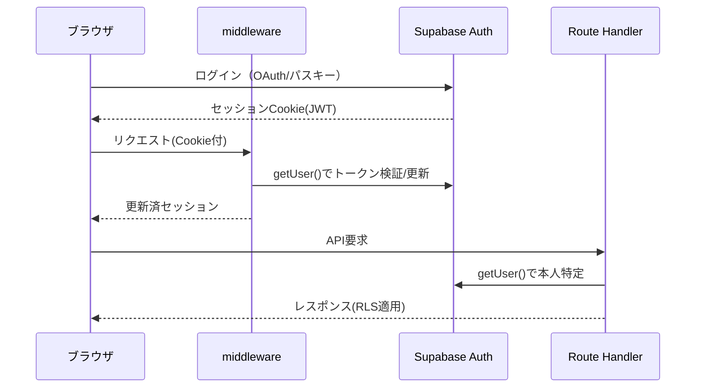

## 1. 本書の目的

シカクルMVPのAPI（Next.js Route Handlers＝BFF、および Supabase 経由アクセス）の仕様を定義する。
実装リポジトリ `src/app/api/*` と整合する。

## 2. 共通仕様

| 項目 | 内容 |
|------|------|
| プロトコル | HTTPS (TLS1.2+) |
| ベースURL | `https://<app-domain>/api`（BFF）。データCRUDは Supabase クライアント経由 |
| データ形式 | JSON (UTF-8) |
| 認証方式 | Supabase セッション（Cookie）。middlewareでトークン更新。DBアクセスはJWT+RLS |
| 認可 | RLS（DB側）＋ Route Handler内の明示チェックで二重化 |
| 日付形式 | ISO 8601（`YYYY-MM-DDThh:mm:ss+09:00`） |

> **設計方針**: 単純なCRUD（検定・設問・受験履歴の取得等）は Supabase クライアント＋RLSで直接行い、独自APIを作らない。
> 決済・Webhook・採点など「サーバー権限や外部連携が必要な処理」のみ Route Handler（BFF）として実装する。

### 2.1 共通レスポンス（エラー形式）

```json
{ "error": "invalid exam" }
```

### 2.2 HTTPステータス

| HTTP | 意味 |
|------|------|
| 200 | 成功 |
| 400 | 入力不正・状態不正 |
| 401 | 未認証 |
| 403 | 権限なし（RLS拒否含む） |
| 404 | 対象なし |
| 500 | サーバ内部エラー |

## 3. 認証・セッションフロー



## 4. API一覧

| API-ID | メソッド | パス | 概要 | 認証 | 対応機能ID | 実装 |
|--------|----------|------|------|------|-----------|------|
| API-301 | POST | `/api/checkout` | 受験料の決済セッション作成 | 要 | F-0301 | `api/checkout/route.ts` |
| API-901 | POST | `/api/stripe/webhook` | Stripe決済/サブスクWebhook受信 | 署名 | F-0301/0303 | `api/stripe/webhook/route.ts` |
| RPC-201 | RPC | `score_attempt()` | 受験の採点（正解秘匿） | 要 | F-0201 | Supabase RPC |
| DATA-101 | (SDK) | `exams` insert/update | 検定作成・公開（RLS） | 要 | F-0101/0102 | Supabaseクライアント |
| DATA-201 | (SDK) | `public_questions` select | 出題取得（正解なし） | 任意 | F-0201 | Supabaseクライアント |
| DATA-104 | (SDK) | `attempts`/`exams` select | ダッシュボード集計 | 要 | F-0104 | Supabaseクライアント |

## 5. API詳細：API-301 受験料決済セッション作成

### 5.1 概要

| 項目 | 内容 |
|------|------|
| API-ID | API-301 |
| メソッド / パス | `POST /api/checkout` |
| 概要 | 有料検定の受験料についてStripe Checkoutセッションを作成しURLを返す |
| 認証・認可 | 要（ログインユーザー）。公開中かつ有料の検定のみ |
| カード情報 | 自社サーバに通さない（Stripe側で処理・SAQ-A） |

### 5.2 リクエスト

**ボディ**

| 項目 | 型 | 必須 | 説明 |
|------|----|------|------|
| `examId` | string(uuid) | ○ | 受験する検定ID |

```json
{ "examId": "0b2f...c9" }
```

### 5.3 レスポンス（200 OK）

| 項目 | 型 | 説明 |
|------|----|----|
| `url` | string | Stripe Checkout の決済URL（リダイレクト先） |

```json
{ "url": "https://checkout.stripe.com/c/pay/cs_test_..." }
```

### 5.4 エラー

| HTTP | 発生条件 |
|------|----------|
| 401 | 未ログイン |
| 400 | 検定が存在しない/非公開/無料（price<=0） |

### 5.5 処理仕様・備考

- `metadata` に exam_id / creator_id / user_id / amount_yen / platform_fee_yen(20%) を格納し、Webhookと月次精算で使用（手動精算・決定B-1）。
- 成功時 `success_url=/exams/{id}?paid=1`、キャンセル時 `cancel_url=/exams/{id}?canceled=1`。

## 6. API詳細：API-901 Stripe Webhook

### 6.1 概要

| 項目 | 内容 |
|------|------|
| API-ID | API-901 |
| メソッド / パス | `POST /api/stripe/webhook` |
| 概要 | 決済・サブスクの結果を受信しDBへ反映 |
| 認証 | **Stripe署名検証**（`stripe-signature`ヘッダ・要件A08） |
| 冪等性 | あり（`payment_intent_id` で upsert） |

### 6.2 処理仕様

- `checkout.session.completed`：`attempts` を paid=true で upsert（手数料記録）。`service_role` でRLSバイパス。
- （TODO）`customer.subscription.*`：`subscriptions` を更新（作成者サブスク）。
- 署名検証失敗時は 400 を返し処理しない。

### 6.3 エラー

| HTTP | 発生条件 |
|------|----------|
| 400 | 署名検証失敗 |

## 7. RPC詳細：score_attempt（採点）

| 項目 | 内容 |
|------|------|
| シグネチャ | `score_attempt(p_attempt_id uuid, p_answers jsonb) → (out_score int, out_passed boolean)` |
| 概要 | 正解を露出せずサーバー側で採点。answers挿入・attempts更新・score/passed返却 |
| 認可 | SECURITY DEFINER。呼び出し元=attempt所有者(`auth.uid()`)を検証。不一致は例外 |
| 入力例 | `[{"question_id":"...","selected_index":1}, ...]` |

## 8. データアクセス（Supabaseクライアント＋RLS）

独自APIを設けない CRUD は、クライアント/サーバーの Supabase SDK で直接行う。認可はRLSが担保する。

| 操作 | テーブル/ビュー | 権限（RLS） |
|------|----------------|------------|
| 検定作成・公開 | exams / questions | 作成者本人のみ |
| 出題取得 | public_questions | 誰でも（正解なし） |
| 受験履歴・ダッシュボード | attempts / exams | 本人 or 当該作成者 |
| イベント記録 | events | 挿入のみ |

---

## 改訂履歴

| 版 | 日付 | 改訂者 | 内容 |
|----|------|--------|------|
| 1.0.0 | 2026-07-05 | PM/アーキテクト | シカクルMVP API設計 初版作成（実装Route Handlerと整合） |
