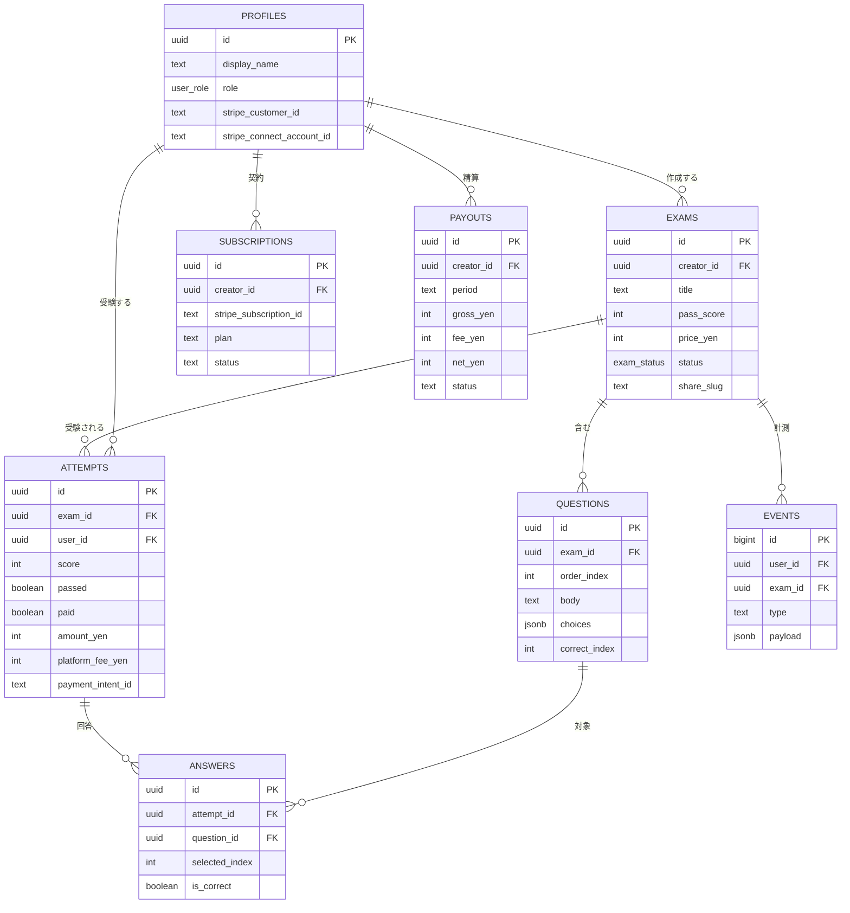
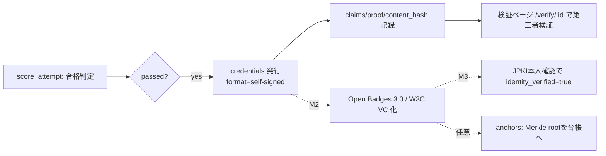

## 1. 本書の目的

シカクルMVPのデータベース設計（ER図・テーブル定義・RLS・RPC）を定義する。
実装リポジトリの `supabase/schema.sql` を正本とし、本書はその設計意図と一覧を示す。

## 2. 設計方針

| 項目 | 内容 |
|------|------|
| DBMS | PostgreSQL（Supabase マネージド） |
| 文字コード | UTF-8 |
| 命名規則 | テーブル: スネークケース複数形 / カラム: スネークケース |
| 採番 | UUID（`gen_random_uuid()`）。events のみ identity（bigint） |
| 認可 | **Row Level Security（RLS）で行レベル権限をDB側から強制**（要件S3/A01） |
| 正解の秘匿 | `questions.correct_index` は受験者に露出させず、`public_questions` ビューと `score_attempt` RPC 経由でのみ判定 |
| 共通カラム | `created_at` / 一部 `updated_at` |
| 論理削除 | MVPは物理削除（`on delete cascade`）。監査要件が出た段階で論理削除を検討 |

## 3. ER図

## 4. テーブル一覧

| 物理名 | 論理名 | 区分 | 概要 | 想定件数(初期) |
|--------|--------|------|------|----------|
| profiles | プロフィール | マスタ | auth.users拡張。role/Stripe顧客ID | 〜数千 |
| exams | 検定 | トランザクション | 検定本体・公開設定・受験料 | 〜数百 |
| questions | 設問 | トランザクション | 3〜4択・正解(秘匿) | 数千 |
| attempts | 受験 | トランザクション | 受験・スコア・決済情報 | 数千〜数万 |
| answers | 回答 | トランザクション | 各設問の回答（分析原資） | 数万〜 |
| events | イベント | ログ | 離脱/共有等の計測原資 | 数十万〜 |
| subscriptions | サブスク | トランザクション | 作成者の月額契約 | 〜数百 |
| payouts | 精算 | トランザクション | 受験料の月次手動精算集計 | 〜数百 |

## 5. テーブル定義（主要）

### 5.1 exams（検定）

| No | 物理名 | 論理名 | 型 | NULL | キー | デフォルト | 説明 |
|----|--------|--------|----|------|------|-----------|------|
| 1 | id | 検定ID | uuid | NO | PK | gen_random_uuid() | |
| 2 | creator_id | 作成者ID | uuid | NO | FK | — | profiles.id |
| 3 | title | タイトル | text | NO | — | — | |
| 4 | description | 説明 | text | YES | — | — | |
| 5 | pass_score | 合格ライン(%) | int | NO | — | 70 | 0-100 |
| 6 | price_yen | 受験料(円) | int | NO | — | 0 | 0=無料 |
| 7 | status | 状態 | exam_status | NO | — | 'draft' | draft/published/suspended |
| 8 | share_slug | 共有スラッグ | text | NO | UQ | ランダム | 公開URL用 |
| 9 | created_at | 作成日時 | timestamptz | NO | — | now() | |
| 10 | updated_at | 更新日時 | timestamptz | NO | — | now() | |

### 5.2 questions（設問）

| No | 物理名 | 論理名 | 型 | NULL | キー | 説明 |
|----|--------|--------|----|------|------|------|
| 1 | id | 設問ID | uuid | NO | PK | |
| 2 | exam_id | 検定ID | uuid | NO | FK | exams.id |
| 3 | order_index | 表示順 | int | NO | — | |
| 4 | body | 問題文 | text | NO | — | |
| 5 | choices | 選択肢 | jsonb | NO | — | 配列（3〜4択） |
| 6 | correct_index | 正解index | int | NO | — | **秘匿。RLSで受験者は直接参照不可** |

### 5.3 attempts（受験）

| No | 物理名 | 論理名 | 型 | NULL | キー | デフォルト | 説明 |
|----|--------|--------|----|------|------|-----------|------|
| 1 | id | 受験ID | uuid | NO | PK | gen_random_uuid() | |
| 2 | exam_id | 検定ID | uuid | NO | FK | — | exams.id |
| 3 | user_id | 受験者ID | uuid | YES | FK | — | profiles.id |
| 4 | score | スコア | int | YES | — | — | 0-100 |
| 5 | passed | 合否 | boolean | YES | — | — | |
| 6 | paid | 支払済 | boolean | NO | — | false | |
| 7 | amount_yen | 受験料 | int | NO | — | 0 | |
| 8 | platform_fee_yen | 手数料 | int | NO | — | 0 | 20%控除分 |
| 9 | payment_intent_id | 決済ID | text | YES | — | — | Stripe PaymentIntent |
| 10 | started_at | 開始日時 | timestamptz | NO | — | now() | |
| 11 | completed_at | 完了日時 | timestamptz | YES | — | — | |

> その他テーブル（profiles / answers / events / subscriptions / payouts）の全カラムは `supabase/schema.sql` を参照。

## 6. インデックス（主要）

| 名称 | 種別 | 対象 | 用途 |
|------|------|------|------|
| exams(creator_id) | INDEX | creator_id | 作成者別一覧 |
| exams(status) | INDEX | status | 公開検定の絞込 |
| exams.share_slug | UNIQUE | share_slug | 公開URL一意 |
| questions(exam_id, order_index) | INDEX | exam_id,order_index | 出題順取得 |
| attempts(exam_id) / (user_id) | INDEX | — | 集計・履歴 |
| events(exam_id, type, created_at) | INDEX | — | 分析クエリ |

## 7. RLS ポリシー（要点）

| テーブル | 参照(SELECT) | 変更(INSERT/UPDATE) |
|----------|-------------|--------------------|
| profiles | 本人のみ | 本人のみ |
| exams | 公開中 or 作成者本人 | 作成者本人 |
| questions | 作成者のみ（受験者はビュー/RPC経由） | 作成者のみ |
| attempts | 本人 or 当該検定の作成者 | 本人のみINSERT |
| answers | 紐づくattemptの本人/作成者 | RPC(score_attempt)経由 |
| events | （挿入のみ許可） | 本人 or 匿名 |
| subscriptions/payouts | 作成者本人（参照のみ） | service_role/Webhook |

> RLSポリシーは情報漏えいに直結するため、権限テスト（他者データにアクセス不可）を必須とする（NFR-SKR-002）。

## 8. ストアド関数（RPC）

| 関数 | 概要 | セキュリティ |
|------|------|------------|
| `handle_new_user()` | auth.users作成時にprofilesを自動生成 | SECURITY DEFINER |
| `score_attempt(attempt_id, answers)` | 正解を露出せずサーバー採点し、answers挿入・attempts更新・score/passed返却 | SECURITY DEFINER。呼び出し元=attempt所有者を検証 |

## 9. データ量・保管・バックアップ

| 項目 | 内容 |
|------|------|
| 年間増加 | attempts/answers/events が主。初期は数万〜数十万行 |
| 保管 | 監査ログ相当（決済/認証）は1年以上（NFR-SKR-001） |
| バックアップ | Supabase自動バックアップ。Proで Point-in-Time Recovery を検討 |

## 10. VC-ready データモデル（将来構想・要件定義⑥）

将来の「本人確認済み検証可能資格（W3C Verifiable Credentials / Open Badges 3.0）」に備え、
**MVP時点から合格証を正規化して蓄積**しておく（後付けは高利の負債になるため）。
MVPでは「自社署名の合格証」までを実装し、VC発行・DID・本人確認・アンカリングはM2以降で有効化する。

> 原則（要件6.3）：**個人番号は保存しない**。**個人データは公開チェーンに載せない**（チェーンにはハッシュ/失効のみ・任意）。

### 10.1 追加テーブル（雛形）

**issuers（発行者）** — 検定発行主体。将来はDIDを持つ。
| No | 物理名 | 型 | NULL | 説明 |
|----|--------|----|------|------|
| 1 | id | uuid | NO | PK |
| 2 | profile_id | uuid | NO | FK profiles.id（作成者） |
| 3 | display_name | text | NO | 発行者表示名 |
| 4 | did | text | YES | 発行者DID（M2以降。例 did:web:） |
| 5 | signing_key_ref | text | YES | 署名鍵の参照（KMS等。秘密鍵はDBに置かない） |
| 6 | created_at | timestamptz | NO | now() |

**credentials（合格証／クレデンシャル）** — 1受験の合格に対して1件発行。
| No | 物理名 | 型 | NULL | 説明 |
|----|--------|----|------|------|
| 1 | id | uuid | NO | PK |
| 2 | attempt_id | uuid | NO | FK attempts.id（発行の根拠） |
| 3 | exam_id | uuid | NO | FK exams.id |
| 4 | issuer_id | uuid | NO | FK issuers.id |
| 5 | subject_id | uuid | YES | FK profiles.id（被発行者。匿名受験時はnull） |
| 6 | format | text | NO | 'self-signed'（MVP）/ 'openbadge-3.0' / 'w3c-vc-2.0' |
| 7 | claims | jsonb | NO | 表示用クレーム（検定名・スコア・合格日など。**機微情報や個人番号は入れない**） |
| 8 | payload | jsonb | YES | VC/OpenBadge本体（M2以降） |
| 9 | proof | jsonb | YES | 署名（発行者鍵によるproof） |
| 10 | content_hash | text | YES | payloadのハッシュ（検証・任意のアンカリング用） |
| 11 | identity_verified | boolean | NO | 本人確認済みか（JPKI連携時true・M3） default false |
| 12 | issued_at | timestamptz | NO | 発行日時 |
| 13 | revoked_at | timestamptz | YES | 失効日時（NULL=有効） |

**revocations（失効レジストリ）** — Bitstring Status List 等に対応。
| No | 物理名 | 型 | NULL | 説明 |
|----|--------|----|------|------|
| 1 | id | uuid | NO | PK |
| 2 | credential_id | uuid | NO | FK credentials.id |
| 3 | reason | text | YES | 失効理由 |
| 4 | status_list_index | int | YES | ステータスリスト上の位置（M2以降） |
| 5 | created_at | timestamptz | NO | now() |

**anchors（オンチェーン・アンカリング／任意・最終段階）** — PIIは載せず、ハッシュのみ。
| No | 物理名 | 型 | NULL | 説明 |
|----|--------|----|------|------|
| 1 | id | uuid | NO | PK |
| 2 | credential_id | uuid | NO | FK credentials.id |
| 3 | merkle_root | text | NO | バッチのMerkle root（個票ハッシュではなく集約） |
| 4 | chain | text | NO | 台帳識別（例: 'polygon'） |
| 5 | tx_ref | text | YES | トランザクション参照 |
| 6 | anchored_at | timestamptz | NO | now() |

### 10.2 発行フロー（合格→クレデンシャル）

### 10.3 RLS方針（追加）
- credentials：被発行者本人・発行者（作成者）は参照可。**検証は公開エンドポイント**（proof/hashのみ返し、個人情報は最小化）。
- issuers/revocations/anchors：発行者本人＝参照、更新は service_role / 発行処理。

---

## 改訂履歴

| 版 | 日付 | 改訂者 | 内容 |
|----|------|--------|------|
| 1.0.0 | 2026-07-05 | PM/アーキテクト | シカクルMVP DB設計 初版作成（schema.sqlと整合） |
| 1.1.0 | 2026-07-05 | PM/アーキテクト | §10「VC-readyデータモデル（将来構想）」追加：issuers/credentials/revocations/anchors 雛形と発行フロー。個人番号非保持・PIIオフチェーン原則を明記 |
