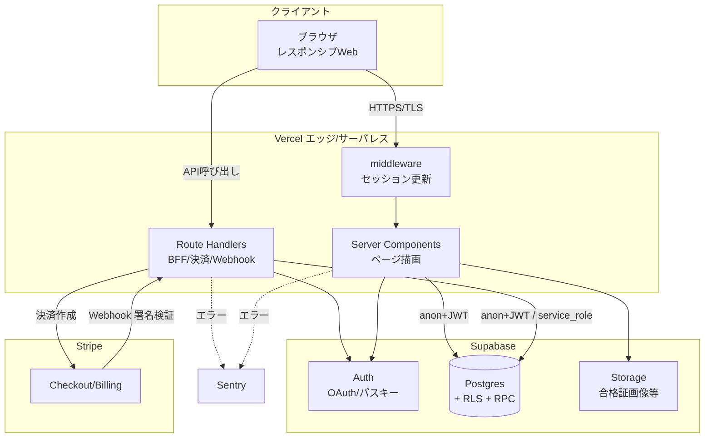
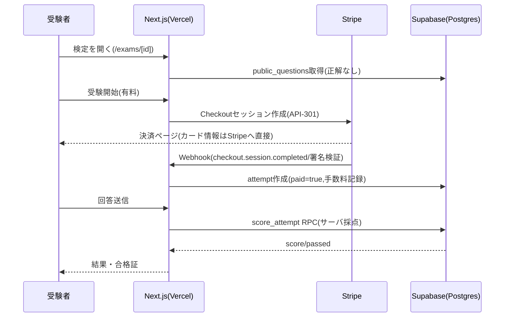

## 1. 本書の目的

シカクルMVPの物理・論理構成、および主要なデータフローを図示する。基本設計書（BD-SKR-001）の詳細補足。

## 2. 全体構成（論理）

## 3. コンポーネント一覧

| # | コンポーネント | 役割 | 提供 | 備考 |
|---|--------------|------|------|------|
| 1 | ブラウザ | UI（作成者/受験者） | — | レスポンシブWeb。MVPはネイティブアプリなし |
| 2 | Vercel | ホスティング・実行環境 | Vercel | Next.js 16。プレビューデプロイ |
| 3 | middleware | セッション更新・認証伝播 | 自作 | `src/middleware.ts` |
| 4 | Route Handlers | BFF・決済・Webhook | 自作 | `src/app/api/*` |
| 5 | Supabase Auth | 認証（OAuth/OIDC・パスキー・MFA） | Supabase | 要件S2 |
| 6 | Supabase Postgres | データ永続化・RLS・採点RPC | Supabase | 要件S3の中核 |
| 7 | Supabase Storage | 合格証画像・アップロード | Supabase | S3互換 |
| 8 | Stripe | 決済・サブスク・（将来Connect） | Stripe | S4/SAQ-A |
| 9 | Sentry | エラー監視・アラート | Sentry | 要件S8/A09 |

## 4. 主要データフロー

### 4.1 受験〜決済〜採点（有料検定）

### 4.2 環境分離

| 環境 | ホスティング | DB/決済 | 用途 |
|------|------------|---------|------|
| 本番(production) | Vercel Production | Supabase本番 / Stripe本番 | 実サービス |
| プレビュー(preview) | Vercel Preview（PR毎） | Supabase（別プロジェクト推奨） / Stripe test | レビュー |
| ローカル(local) | localhost:3000 | Supabaseローカル or 開発 / Stripe test | 開発 |

> 非本番環境は本番個人情報を持ち込まない（ダミー/マスキング・要件S7）。

## 5. ネットワーク・セキュリティ境界

- 全経路 TLS 強制（HSTS）。カード情報は自社境界を通らずStripeで処理（CDE外・SAQ-A）。
- `service_role` キーはサーバー（Route Handler）内のみ。クライアントには anon key のみ露出。
- 秘密情報は Vercel/Supabase の環境変数で管理し、コミットしない（S5）。

---

## 改訂履歴

| 版 | 日付 | 改訂者 | 内容 |
|----|------|--------|------|
| 1.0.0 | 2026-07-05 | PM/アーキテクト | シカクルMVPシステム構成 初版作成 |
