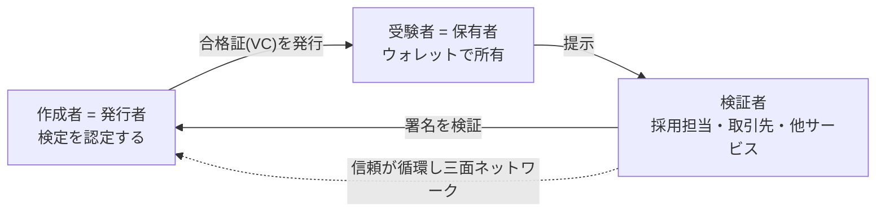

> 本メモは、シカクルの合格証を「本人確認済み・改ざん不可・持ち運び可能な資格」に進化させる技術構成（DID / VC / Open Badges 3.0 / JPKI）の要点をまとめる。
> 要件定義 REQ-SKR-001 ⑥とDB設計（DB-SKR-001 §10）の補足。**投資家資料 ROADMAP 優先により Phase 1（MVP第1リリース直後の fast-follow）で着手**する（旧版は将来構想＝M2/M3）。

## 0. 序章 — この構成で「何が叶う」のか（やさしい解説）

いま検討している4つの部品を、まず一言で。

| 部品 | 一言でいうと | 役割 |
|------|-------------|------|
| **JPKI**（公的個人認証） | マイナンバーカードで「本人であること」を国の仕組みで確認 | **本人性**（誰が、を保証） |
| **DID**（分散型ID） | 特定サービスに依存しない“自分専用のデジタルID” | **持ち主**（本人・発行者を識別） |
| **VC**（検証可能クレデンシャル） | 改ざんできない・単体で真偽確認できる電子証明書 | **改ざん不可・第三者検証** |
| **Open Badges 3.0** | その証明書を「資格バッジ」として表す世界標準（VC準拠） | **資格としての相互運用** |

これらを組み合わせると、シカクルの「合格証」は**ただの画像**から、**社会で通用する資格インフラ**へ変わります。具体的に叶うのは次の4つです。

1. **詐称できない** — 合格証は暗号署名され、誰でも真偽を確認できる。「自称」が通用しない。
2. **本人のものだと証明できる** — JPKIで本人確認された資格なら、替え玉・なりすましを排除できる。
3. **持ち運べる** — 資格は本人の“ウォレット”に入り、シカクルを退会しても残る。履歴書・SNS・他サービスへ提示できる。
4. **有効/失効を管理できる** — 期限切れ・取り消しを追跡でき、年次更新など運用に載せられる。

### だれが、何をできるようになるか（2側面＋検証者）


- **受験者（個人）**：一生モノの「本人証明つき資格」を貯めて、どこへでも持ち歩ける。
- **作成者（企業/クリエイター）**：自社が“認定機関”になり、詐称できない資格を発行できる。採用・ファン施策・研修証明が一段強くなる。
- **検証者（第3の主役）**：発行者に問い合わせなくても、その場で資格の真偽を確認できる。

> つまりこの構成は、シカクルを「検定を作るツール」から「**発行・保有・検証を担う資格インフラ**」へ引き上げます。これが強い差別化（Moat）になります。
> ただし大原則：**個人番号は保存しない／個人データは公開ブロックチェーンに載せない**（要件6.3）。ブロックチェーンは使うとしても「ハッシュの刻印」だけの任意採用です。

---

## 1. 各要素の要点

### 1.1 JPKI（公的個人認証）
- マイナンバーカードのICチップ内の**電子証明書**でオンライン本人確認を行う仕組み。
- **個人番号（12桁）そのものは扱わない**。本人性のみ確認（番号法の制約回避）。
- 実装は自前ではなく**JPKI対応の外部eKYCベンダー**（TRUSTDOCK等）に委譲。犯収法の書類画像方式（ホ方式）は2027年4月廃止方向のため、新規設計はJPKI前提。

### 1.2 DID（Decentralized Identifier）
- 特定の発行者に依存しない識別子（例：`did:web:`, `did:key:`）。発行者・受領者の識別に使う。
- DID Documentに**公開鍵**が載り、VCの署名検証に使われる。秘密鍵はKMS等で厳重管理（DBに置かない）。

### 1.3 VC（Verifiable Credentials, W3C）
- 「発行者が主体について述べた、改ざん不可・暗号検証可能な主張」。JSON-LDで表現し、`proof`（署名）を持つ。
- **発行者に問い合わせずに単体で検証**できる（オフライン可）。失効は`credentialStatus`で管理。

### 1.4 Open Badges 3.0（1EdTech）
- **VCとして表現されたデジタルバッジ標準**。`OpenBadgeCredential`（=VC）として合格/達成を表す。
- 2.0（画像にメタデータを焼き込み・発行者URLで検証）から、**保有者中心・暗号検証・ウォレット持ち運び・DID対応**へ刷新。

#### 2.0 → 3.0 の違い
| 観点 | 2.0 | 3.0 |
|---|---|---|
| 実体 | 画像に焼き込むAssertion | **VC（AchievementCredential）** |
| 検証 | 発行者URL照会 / JWS | **署名で単体検証**（問い合わせ不要） |
| 主体 | 発行者中心 | **保有者中心**（ウォレット保存） |
| 識別子 | メール等 | **DID** も利用可 |
| プライバシー | 弱い | **選択的開示**が可能 |

#### 主要オブジェクト
- **Issuer/Profile**（発行者・DID）／**Achievement**（達成の定義：name・**criteria**・**alignment**＝スキル体系・image）
- **credentialSubject / AchievementSubject**（受領者ID＋**result**＝スコア＋**evidence**＝証跡）
- **proof**（Data Integrity: eddsa-rdfc-2022 等、または VC-JWT）／**credentialStatus**（Bitstring Status List で失効）／**validFrom・validUntil**

## 2. 合格証を OB3.0 で発行する例（最小イメージ）
```json
{
  "@context": [
    "https://www.w3.org/ns/credentials/v2",
    "https://purl.imsglobal.org/spec/ob/v3p0/context-3.0.3.json"
  ],
  "type": ["VerifiableCredential", "OpenBadgeCredential"],
  "issuer": { "id": "did:web:shikakuru.app:issuers:idolA", "type": ["Profile"], "name": "アイドルA（公式）" },
  "validFrom": "2026-07-05T09:00:00+09:00",
  "credentialSubject": {
    "type": ["AchievementSubject"],
    "id": "did:key:z6Mk...受験者DID",
    "achievement": {
      "id": "https://shikakuru.app/achievements/idolA-official",
      "type": ["Achievement"],
      "name": "アイドルA 公式ファン検定 合格",
      "criteria": { "narrative": "全3問中70%以上で合格" },
      "description": "本人確認済みの公式ファン資格"
    },
    "result": [{ "type": ["Result"], "achievedLevel": "合格", "resultDescription": "score", "value": "100" }]
  },
  "credentialStatus": {
    "type": "BitstringStatusListEntry",
    "statusListIndex": "1240",
    "statusListCredential": "https://shikakuru.app/status/1"
  },
  "proof": { "type": "DataIntegrityProof", "cryptosuite": "eddsa-rdfc-2022", "proofValue": "z..." }
}
```

## 3. DB設計（DB-SKR-001 §10）との対応
| 概念 | 保存先 |
|------|--------|
| 発行者・DID | `issuers.did` / `signing_key_ref`（鍵はKMS） |
| クレデンシャル本体 | `credentials.payload`（上記JSON）、`format='openbadge-3.0'` |
| 署名 | `credentials.proof` |
| 検証用ハッシュ | `credentials.content_hash`（任意でアンカリング） |
| 受領者 | `credentials.subject_id`（DIDは payload 側 `credentialSubject.id`） |
| 失効 | `revocations` ＋ `credentialStatus`（Status List） |
| 本人確認済み | `credentials.identity_verified`（JPKI連携時 true） |
| オンチェーン刻印（任意） | `anchors.merkle_root`（個票でなくバッチのMerkle root） |

## 4. 段階導入（要件⑥6.4と整合・投資家資料優先でPhase 1前倒し）
| 段階 | 実施 |
|------|------|
| Phase 1・第1リリース(MVP) | 自社署名の合格証＋検証ページ。`credentials`を正規化して蓄積（VC-readyだけ確保）。まずコアループ検証 |
| Phase 1・fast-follow | **OB3.0 / W3C VC 発行**（DID・失効リスト）＋ **JPKI eKYCで本人確認**→「本人確認済みバッジ」。既存主要検定と連携（**個人番号は非保持**） |
| Phase 2 | 紙資格→デジタル移行、業界団体提携。R3（バッジ発行料¥200/回）を本格運用 |
| Phase 3 | 公的認可・国民デジタル資格ウォレット。**任意**：VCハッシュを公開台帳へアンカリング（PIIは終始オフチェーン） |

> 注：⑥6.4と同じく、投資家資料 ROADMAP を優先し OB＋マイナを Phase 1 に前倒し。第1リリースはコアループ検証を優先し、OB/本人確認は直後の fast-follow とする。

## 5. 実装の勘所
- 署名鍵は**DBに置かずKMS/HSM**で管理。公開鍵（DID Document）で検証。
- 失効は Status List をホスティング。`validUntil`＋再発行で**年次更新のサブスク化**も可能。
- 検証エンドポイント（`/verify/:id`）は **proof/hash のみ**返し、個人情報は最小化。
- `@context` の版・cryptosuite は**導入時に1EdTech/W3Cの最新仕様で必ず確認**（マイナー版が上がる）。

## 6. 参考（一次情報／導入時に要確認）
- W3C Verifiable Credentials Data Model（VC 2.0）
- 1EdTech Open Badges 3.0 仕様・`@context`・適合性プログラム
- Bitstring Status List（失効）
- デジタル庁：JPKI／デジタル認証アプリ、番号法（個人番号の民間利用制限）、犯収法（本人確認方式）

---

## 改訂履歴

| 版 | 日付 | 改訂者 | 内容 |
|----|------|--------|------|
| 1.0.0 | 2026-07-05 | PM/アーキテクト | 初版。序章（この構成で叶うこと）＋OB3.0/VC/DID/JPKI要点・DB対応・段階導入を記載 |
| 1.1.0 | 2026-07-05 | PM/アーキテクト | 投資家資料ROADMAP優先：OB＋マイナをPhase 1へ前倒し（序章・§4段階導入を更新） |
