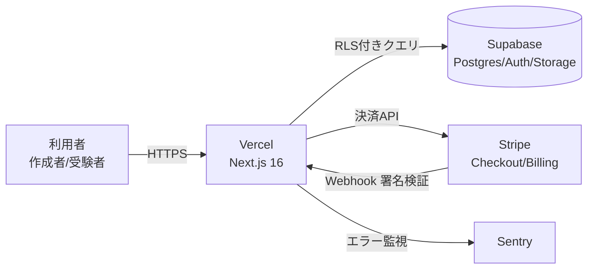

## 1. 本書の目的

要件定義書（REQ-SKR-001）に基づき、シカクルMVPの全体構造・機能・画面・データ・外部連携の設計方針を定義する。
本書は実装リポジトリ（`tsunagibito/shikakuru`）のスキャフォールドと整合する。

> **関連文書**: システム構成図（ARC-SKR-001）／ 画面遷移図（SCT-SKR-001）／ DB設計書（DB-SKR-001）／ API設計書（API-SKR-001）／ 要件定義書（REQ-SKR-001）

## 2. システム化方針

| 項目 | 方針 |
|------|------|
| アーキテクチャ | Jamstack + BaaS。Next.js（App Router）による SSR/RSC 一体構成。専用APサーバは持たず、Route Handlers（BFF）＋ Supabase（Postgres/Auth/Storage）＋ Stripe。 |
| 採用技術 | Next.js 16 / TypeScript / Tailwind CSS v4 / Supabase / Stripe / Vercel（詳細は要件定義③） |
| 重要な決定事項 | ①認可は Supabase RLS で DB 側から強制（要件S3） ②検定の正解は露出せず採点RPCで判定（S3/B-3） ③カード情報非保持＝Stripeトークン化（S4/SAQ-A） ④受験料分配は月次手動精算で開始（決定B-1） ⑤分析原資（events）を最初から蓄積（負債化防止） |
| 対象外（MVP） | マイナンバー(JPKI)本人確認・マーケットプレイス発見機能・エンタープライズ機能・高度分析（要件②Should/Could） |

## 3. システム全体構成

> 詳細はシステム構成図（ARC-SKR-001）参照。

## 4. 機能設計

| 機能ID | 機能名 | 処理概要 | 入力 | 出力 | 関連画面/API |
|--------|--------|----------|------|------|--------------|
| F-0001 | 認証 | Supabase Authでサインアップ/ログイン | 資格情報 | セッション | SCR-000 / (Supabase) |
| F-0101 | ノーコード問題作成 | 検定・設問を作成し保存 | 検定情報・設問 | 検定ID | SCR-100 / API-101 |
| F-0102 | 検定公開設定 | 公開範囲・受験料・合格ラインを設定し公開 | 公開設定 | 公開URL | SCR-101 / API-102 |
| F-0201 | 検定受験・採点 | 出題→回答→採点RPC | 回答 | スコア・合否 | SCR-200 / API-201 |
| F-0202 | 合格証発行 | 合格時に証明ページ発行 | attempt | 合格証URL | SCR-201 / API-202 |
| F-0301 | 受験料決済 | Stripe Checkoutで決済 | examId | 決済URL | SCR-200 / API-301 |
| F-0303 | 作成者サブスク | PRO/ENTERPRISE課金 | plan | サブスク状態 | SCR-102 / API-303 |
| F-0104 | ダッシュボード | 受験数・売上表示 | — | 集計 | SCR-102 / API-104 |

## 5. 画面設計（概要）

> 詳細は画面遷移図（SCT-SKR-001）参照。画面設計書（SD-SKR-001）は次フェーズで作成。

| 画面ID | 画面名 | 概要 | 主な機能 | 実装パス |
|--------|--------|------|----------|----------|
| SCR-000 | ログイン/登録 | 認証 | F-0001 | (Supabase Auth UI) |
| SCR-010 | ランディング | サービス紹介・導線 | — | `/` |
| SCR-100 | 検定エディタ | ノーコード問題作成 | F-0101 | `/dashboard/exams/new` |
| SCR-101 | 検定公開設定 | 公開・受験料設定 | F-0102 | `/dashboard/exams/[id]/settings` |
| SCR-102 | 作成者ダッシュボード | 一覧・売上・サブスク | F-0104/0303 | `/dashboard` |
| SCR-200 | 受験画面 | 出題・回答・決済 | F-0201/0301 | `/exams/[id]` |
| SCR-201 | 結果・合格証 | 合否・合格証・共有 | F-0202 | `/exams/[id]/result` |

## 6. データ設計（概要）

> 詳細はDB設計書（DB-SKR-001）参照。

| エンティティ | 概要 | 主なキー |
|--------------|------|----------|
| profiles | ユーザープロフィール（auth.users拡張） | id |
| exams | 検定 | id / creator_id |
| questions | 設問（正解を秘匿） | id / exam_id |
| attempts | 受験 | id / exam_id / user_id |
| answers | 回答（分析原資） | id / attempt_id |
| events | イベントログ（分析原資） | id |
| subscriptions | 作成者サブスク | id / creator_id |
| payouts | 受験料の手動精算集計 | id / creator_id |

## 7. 外部インターフェース設計

> 詳細はAPI設計書（API-SKR-001）参照。

| IF-ID | 連携先 | 方向 | 方式 | 概要 |
|-------|--------|------|------|------|
| EXT-STRIPE-1 | Stripe | 送信 | REST | Checkout セッション作成・サブスク |
| EXT-STRIPE-2 | Stripe | 受信 | Webhook | 決済/サブスク結果（署名検証） |
| EXT-SUPA | Supabase | 双方向 | REST/Realtime | DB/認証/ストレージ |
| EXT-SNS | X 等 | 送信 | Web Share/OGP | 合格証の共有（FR-006） |

## 8. バッチ設計（概要）

| バッチID | 名称 | 起動契機 | 概要 |
|----------|------|----------|------|
| BATCH-PAYOUT | 月次精算集計 | 月次 | attempts を作成者別に集計し payouts を生成（手動精算・決定B-1） |

## 9. 共通設計方針

| 項目 | 方針 |
|------|------|
| 認証・認可 | Supabase Auth（OAuth/OIDC・パスキー）＋ RLS。管理系はMFA必須。認可はDB(RLS)とアプリ層で二重化（要件S2/S3） |
| エラーハンドリング | Route Handlerは統一エラー形式（API設計書2.2）。機密情報をメッセージに含めない（A10） |
| ログ出力 | 認証・決済・認可イベントを監査ログ化。個人情報はログに残さない（S7/S8）。Sentryで異常検知 |
| メッセージ管理 | 日本語UI。将来の多言語はCould（CR-005） |
| コード設計 | enum（user_role/exam_status）等はDB型で管理。状態遷移はアプリ層で制御 |
| セキュリティヘッダ | HSTS等を `next.config.ts` で付与（S1） |

## 10. 移行・運用方針（概要）

- 移行: 新規サービスのため既存データ移行なし。
- 運用: Vercel/Supabase/Stripeのマネージド機能に委譲。監視はSentry＋各基盤メトリクス（NFR-SKR-001）。

---

## 改訂履歴

| 版 | 日付 | 改訂者 | 内容 |
|----|------|--------|------|
| 1.0.0 | 2026-07-05 | PM/アーキテクト | シカクルMVP基本設計 初版作成（実装スキャフォールドと整合） |
