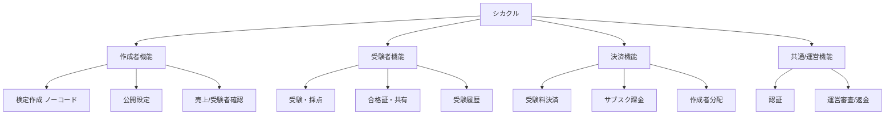

## 1. 本書の目的

シカクルMVPの全機能を階層的に一覧化し、要求（REQ-SKR-001）とのトレーサビリティを確保する。
本一覧は要件定義書「② 機能要件」を機能単位に分解したものである。

## 2. 機能階層

## 3. 機能一覧

> 区分: オンライン / バッチ / 外部IF。優先度: Must / Should / Could（MoSCoW）。対応要求IDは REQ-SKR-001 の FR/SR/CR。

| 機能ID | 大分類 | 中分類 | 機能名 | 概要 | 区分 | 優先度 | 対応API-ID | 対応要求ID |
|--------|--------|--------|--------|------|------|--------|-----------|-----------|
| F-0001 | 共通 | 認証 | サインアップ/ログイン | メール＋PW / ソーシャル / パスキー | オンライン | Must | API-0001 | FR-001 |
| F-0002 | 共通 | 認証 | MFA（運営・管理） | 管理系はMFA必須 | オンライン | Must | API-0002 | FR-001 |
| F-0101 | 作成者 | 作成 | ノーコード問題作成 | 3〜4択をフォームで作成・テンプレ開始 | オンライン | Must | API-0101 | FR-002 |
| F-0102 | 作成者 | 公開 | 検定公開設定 | タイトル/説明/合格ライン/受験料/公開範囲、公開URL発行 | オンライン | Must | API-0102 | FR-003 |
| F-0103 | 作成者 | 管理 | 自検定一覧・編集 | 下書き/公開/停止の状態管理 | オンライン | Must | API-0103 | FR-010 |
| F-0104 | 作成者 | 分析 | 受験数・合格率・売上表示 | 最小限の数値ダッシュボード | オンライン | Must | API-0104 | FR-011 |
| F-0201 | 受験者 | 受験 | 検定受験・自動採点 | 出題→回答→即時採点→スコア | オンライン | Must | API-0201 | FR-004 |
| F-0202 | 受験者 | 証明 | デジタル合格証発行 | 合格時に証明ページ/画像を自動発行 | オンライン | Must | API-0202 | FR-005 |
| F-0203 | 受験者 | 拡散 | SNS共有（OGP） | 結果/合格証をX等へ共有 | オンライン | Must | API-0203 | FR-006 |
| F-0204 | 受験者 | 履歴 | 受験履歴・合格証管理 | マイページで一覧 | オンライン | Must | API-0204 | FR-010 |
| F-0301 | 決済 | 従量 | 受験料決済 | Stripeカード/ウォレット決済（トークン化） | オンライン | Must | API-0301 | FR-007 |
| F-0302 | 決済 | 分配 | 手数料20%控除・作成者分配 | MVPは月次精算 or Connect自動（要確認B-1） | オンライン/バッチ | Must | API-0302 | FR-008 |
| F-0303 | 決済 | 定額 | 作成者サブスク課金 | PRO/ENTERPRISEプラン課金・状態管理 | オンライン | Must | API-0303 | FR-009 |
| F-0401 | 運営 | 審査 | 検定停止・通報対応 | 不適切検定の停止 | オンライン | Must | API-0401 | FR-012 |
| F-0402 | 運営 | 返金 | 返金処理 | Stripe返金の最小オペ | オンライン | Must | API-0402 | FR-012 |
| F-9001 | 共通 | ログ | イベント/回答ログ蓄積 | 分析原資を確実に蓄積（負債化防止） | バッチ/オンライン | Must | — | FR-011 |
| F-5001 | 作成者 | 分析 | 高度分析（離脱/カンニング検索） | 可視化は次フェーズ | オンライン | Should | — | SR-001 |
| F-5002 | 受験者 | 証明 | オープンバッジ準拠合格証 | 1EdTech準拠 | オンライン | Should | — | SR-002 |
| F-5003 | 共通 | 発見 | 検索・カテゴリ・ランキング | マーケットプレイスUI | オンライン | Should | — | SR-003 |
| F-5004 | 受験者 | 特典 | 合格者クーポン | 飲食セグメント特化 | オンライン | Should | — | SR-004 |
| F-5005 | 企業 | 組織 | 組織メンバー管理・限定公開・SSO | ENTERPRISE機能 | オンライン | Should | — | SR-005 |
| F-5006 | 決済 | 発行料 | デジタルバッジ発行料(R3・¥200/回) | 収益3本目。合格時のバッジ発行課金 | オンライン | Should | API-303 | SR-007 |
| F-5007 | 運営 | 認定 | 認定/未認定の審査フロー | 発行者の信頼階層。exams.certified更新 | オンライン | Should | — | SR-008 |
| F-5008 | 集客 | 連携 | 求人サイト連携（リクナビ/マイナビ/ビズリーチ） | 合格者×求職者の送客 | 外部IF | Should | — | SR-009 |
| F-7001 | 共通 | 本人確認 | JPKI（マイナンバーカード）eKYC連携 | 外部eKYCベンダー連携。個人番号は非保持。**資料優先でPhase 1へ前倒し** | 外部IF | Should(P1) | — | CR-001 |
| F-7002 | 作成者 | 作成 | AI問題自動生成 | ナレッジ→検定の自動化 | オンライン | Could | — | CR-002 |
| F-7003 | 連携 | 採用 | ATS連携（採用管理システムAPI） | 合格資格を選考に直結（検証者接続） | 外部IF | Could | — | CR-006 |
| F-7004 | 集客 | 開放 | 有名人・インフルエンサー3ヶ月無料開放 | ローンチ時ブーム創出。期間限定制御 | オンライン | Could | — | CR-007 |
| F-7005 | 試験運営 | 配信 | オンライン試験配信・採点 | 第3ステークホルダー。紙資格→デジタル移行 | オンライン/バッチ | Could | — | CR-008 |
| F-7006 | 代理店 | 卸 | リセラー/卸値・問題設計コンサル | 第4ステークホルダー。代理店アカウント | オンライン | Could | — | CR-009 |
| F-7007 | 集客 | 紹介 | アフィリエイト報酬（紹介リンク） | 指定リンク経由の受験でインフルエンサーに手数料の10%を送金。自社費用としてStripe Connect送金。ステマ表示・税務前提 | オンライン/外部IF | Could | — | CR-010 |

## 4. 機能数サマリ

| 優先度 | 件数 | 備考 |
|--------|------|------|
| Must | 16 | MVP第1リリース（コアループ） |
| Should | 9 | Phase 1 fast-follow 中心（OB/本人確認/バッジ発行料/認定/求人連携 等） |
| Could | 5 | AI生成・ATS・有名人開放・試験配信・代理店 |
| 合計 | 30 | — |

> 投資家資料反映により機能を24→30に拡張。うち F-7001（JPKI本人確認）は資料優先で Phase 1（Should扱い）へ前倒し。

---

## 改訂履歴

| 版 | 日付 | 改訂者 | 内容 |
|----|------|--------|------|
| 1.0.0 | 2026-07-04 | PM/アーキテクト | シカクルMVP機能一覧 初版作成 |
