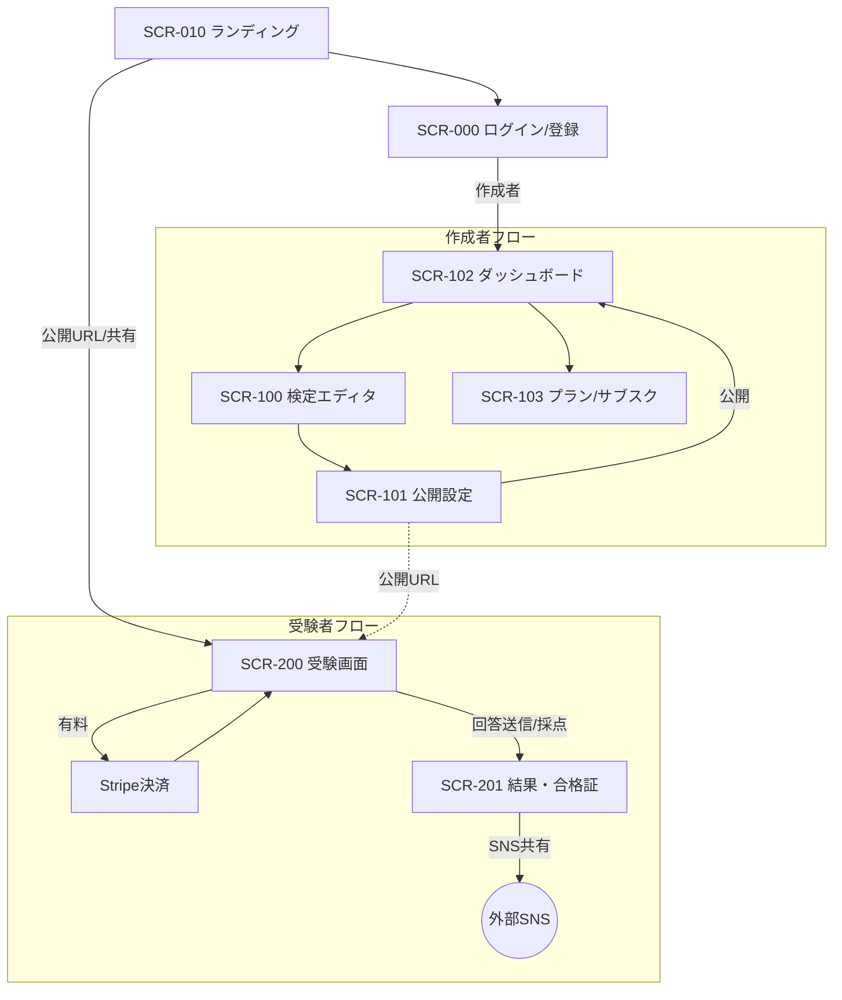
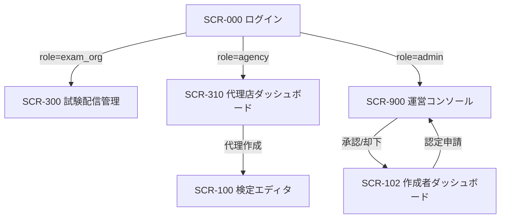

## 1. 本書の目的

シカクルMVPの画面間遷移と遷移契機・条件を定義する。基本設計書（BD-SKR-001）5章の詳細。

## 2. 画面遷移図（全体）

## 3. 遷移定義

| No | 遷移元 | 操作 | 遷移先 | 遷移条件 | 引継ぎデータ |
|----|--------|------|--------|----------|--------------|
| 1 | SCR-010 | ログイン | SCR-000 | — | — |
| 2 | SCR-000 | 認証成功(作成者) | SCR-102 | Supabase認証OK | セッション |
| 3 | SCR-102 | 新規作成 | SCR-100 | — | — |
| 4 | SCR-100 | 次へ | SCR-101 | 設問1件以上 | 検定ドラフト |
| 5 | SCR-101 | 公開 | SCR-102 | 必須項目OK | 公開URL |
| 6 | SCR-010/共有 | 検定を開く | SCR-200 | 検定が公開中 | exam_id |
| 7 | SCR-200 | 受験開始(有料) | Stripe決済 | price>0 | exam_id |
| 8 | Stripe決済 | 決済完了 | SCR-200 | Webhook成功 | payment_intent |
| 9 | SCR-200 | 回答送信 | SCR-201 | 全問回答 | 回答→採点RPC |
| 10 | SCR-201 | SNS共有 | 外部SNS | 合格 | 合格証URL/OGP |

## 3.5 拡張ロールの遷移（投資家資料反映）

| No | 遷移元 | 操作 | 遷移先 | 条件 |
|----|--------|------|--------|------|
| 11 | SCR-000 | ログイン(exam_org) | SCR-300 | role=exam_org |
| 12 | SCR-000 | ログイン(agency) | SCR-310 | role=agency |
| 13 | SCR-102 | 認定申請 | SCR-900 | 作成者が申請 |
| 14 | SCR-900 | 承認/却下 | SCR-102 | 運営が審査（exams.certified更新） |
| 15 | SCR-310 | 代理作成 | SCR-100 | 代理店がクライアント検定を作成 |

## 4. 共通遷移ルール

- 未認証で作成者機能アクセス：ログイン画面（SCR-000）へ誘導。
- セッションタイムアウト：再認証（middlewareがトークン更新、失効時はログインへ）。
- 権限なしアクセス（他者の検定編集等）：RLSで拒否＋403エラー表示。
- 無料検定：決済ステップ（No.7-8）をスキップして直接受験。
- 受験は原則ログインを推奨（有料・履歴管理のため）。無料検定の匿名受験可否は要検討（要確認B-3関連）。

---

## 改訂履歴

| 版 | 日付 | 改訂者 | 内容 |
|----|------|--------|------|
| 1.0.0 | 2026-07-05 | PM/アーキテクト | シカクルMVP画面遷移 初版作成 |
| 1.1.0 | 2026-07-05 | PM/アーキテクト | 投資家資料反映：拡張ロール(exam_org/agency/admin)・認定審査フロー・新画面(SCR-300/310/900)を追加 |
