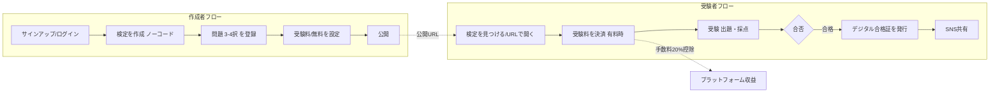
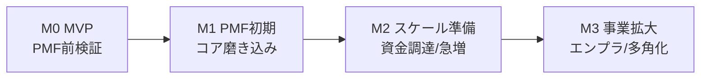

> 本書は、スタートアップの初期検証（スモールスタート／MVP）を前提とした、シカクルの要件定義書である。
> 「最速で市場に価値を届ける」ことを最優先に、**挑戦する部分**と**妥協（割り切る）部分**を明示し、
> それぞれの選択が将来に及ぼす影響（拡張性・技術負債）をセットで記述する。
>
> **関連文書**: 機能一覧（FNL-SKR-001）／ 非機能要件定義書（NFR-SKR-001）／ セキュリティ要件定義書（SEC-SKR-001）

---

## 0. 意思決定ログ（2026-07-05 発注者確認反映）

発注者ヒアリングにより、以下を確定した（詳細は各章および末尾の【要確認事項】一覧の「回答/方針」列を参照）。

| ID | 論点 | 決定 |
|----|------|------|
| A-1 | 初期ターゲット | **クリエイター/ファン検定を第1優先**とし、飲食・IT採用を次点セグメントとして順次展開（Phase順：クリエイター → 飲食 → IT採用）。 |
| B-1 | 受験料分配 | **手動精算で開始 → 流通量拡大時に Stripe Connect 自動分配へ移行**。 |
| D-3 | 分配の法的整理 | 受験料の預り・分配に関する**資金決済法（資金移動業）／収納代行の整理は法務確認を継続**（下記【要確認事項】に残置）。 |
| E-2 | 資金・人員・時期 | **未定**（確定後にMVPスコープとスケジュールを再確定）。 |
| 他 | A-2/A-3/B-2/B-3/C-1/C-2/C-3/D-1/D-2/E-1 | **PM推奨のデフォルトを採用**（末尾一覧の「回答/方針」列に記載）。異議があれば個別に上書き。 |

> 未確定で残るのは **D-3（法務確認）** と **E-2（前提条件）／E-1（トリガー具体値）** の3点。他はデフォルト採用で前進可能。

---

## ① サービス概要とMVPのゴール

### 1.1 サービスの核心的価値（資料からの読み取り）

シカクルは、**企業や個人（クリエイター）が持つ「社内ナレッジ・専門知識」を『検定（クイズ）』化し、それ自体を収益源とマーケティング資産に変える「検定マーケティングプラットフォーム」**である。

資料（PROBLEM / SOLUTION / VALUE）から読み取れる核心は以下のとおり。

| 観点 | 内容 |
|------|------|
| 解く課題 | 広告が「お金を払って消される」時代（有料広告ブロック浸透 / Cookie規制によるCPA高騰 / タイムラインで一瞬でスルー）。従来の"見せる広告"が届かない。 |
| 逆転の発想 | 「消される広告」ではなく、ユーザーが**自ら進んで挑戦する『検定』**へ。ナレッジ → 検定化 → 稼ぎながらPR。 |
| 提供価値（一石四鳥） | ①受験料マネタイズ ②ファン化（ロイヤルティ向上） ③高精度なゼロパーティデータ取得 ④SEO/UGCの自然発生（合格自慢の拡散・カンニング検索での滞在時間向上） |
| ポジショニング | 「エンタメ気質 × 企業マーケティング」の空白地帯（クイズアプリ／LMS／Courseraのいずれとも異なる）。 |
| 収益構造 | **月額サブスク（PRO ¥19,000〜／ENTERPRISE ¥39,000〜）× 受験料手数料20%（平均¥600/回）のハイブリッド**。MRR（安定収益）＋トランザクション（成長収益）。 |

**利用者は2サイド**：
- **作成者サイド**（企業／クリエイター）＝ 検定を出品し、PR・採用・ファン化・マネタイズを狙う。
- **受験者サイド**（一般ユーザー）＝ 検定に挑戦し、合格証（デジタルバッジ）を得て、SNSで共有する。

このプラットフォームの成否は「**作成者が集まり、良質な検定が生まれ、受験者が挑戦し、双方が満足して戻ってくる**」という2サイドのループが回るかにかかっている。これが検証すべき本質である。

### 1.2 スモールスタートで「検証すべき最小限のゴール」

MVPは全機能の実装ではなく、**ビジネスモデルの根幹となる仮説を最小コストで検証する**ことを目的とする。

**MVPで検証する中心仮説（Value Hypothesis）**
> 「作成者は専門知識をノーコードで検定化して公開でき、受験者はそれを楽しんで受験・合格証取得・共有する。そしてその一連の体験に、作成者は月額を、受験者は受験料を払う価値を感じる。」

**検証ゴール（Exit Criteria / 定量）** ※初期値は仮置き。1.4で要確認。

| # | 検証項目 | 指標（例） | MVP目標（例） |
|---|----------|-----------|--------------|
| G1 | 作成者が自力で検定を公開できるか | 検定公開までの離脱率／所要時間 | 資料訴求「最短5分」を実測で検証、公開完了率 ≥ 60% |
| G2 | 受験者が検定を最後まで解くか | 受験開始→完了率 | 完了率 ≥ 70% |
| G3 | ファン化・再訪が起きるか | 合格後の再訪・SNS共有率 | 合格者の共有率 ≥ 15% |
| G4 | 受験料課金が成立するか（従量収益） | 有料検定の受験→決済完了率 | 決済完了率 ≥ 50%（有料検定） |
| G5 | 作成者が継続課金する価値を感じるか（MRR） | PRO/ENTERPRISE 有料転換・継続 | 初期パイロット企業のうち有料継続 ≥ 3社 |

**MVPの成功 = 「作る→受ける→（少額）課金される→戻ってくる」の一連が、限定ドメインで一度でも健全に回ること。**

### 1.3 MVPのターゲット・スコープ（絞り込み）

資料のGTM戦略（就活・転職層 → コレクター層 → リターン希望者層）とケーススタディを踏まえ、**MVPは最も検証しやすい1〜2セグメントに絞る**。

- **確定：第1優先ターゲット = CASE STUDY 04（エンタメ／クリエイター：ファン向け公式検定 ¥980）**。
  - 理由：①受験者の熱量が高く「有料受験・共有」を検証しやすい ②作成者が個人〜小規模で意思決定が速い ③マイナンバー本人確認・組織管理などの重厚な機能が不要。
- **展開順（確定）**：Phase 1 クリエイター/ファン → Phase 2 飲食（CASE 03：合格者クーポン）→ Phase 3 IT採用（CASE 01：採用理解度チェック）。飲食・IT採用は同一コア基盤で機能追加（クーポン発行・限定公開等）により順次対応する。
- **後回し**：エンタープライズ（採用選考連動・組織メンバー管理・限定公開）、代理店網、公式アンバサダー起用は**販売戦略であり、MVPのプロダクト検証には不要**。

### 1.4 【要確認事項（①関連）】
- **A-1** MVPの初期ターゲットは「クリエイター/ファン検定」「飲食」「IT/採用」のどれを最優先にしますか（本書は"クリエイター/ファン"を仮置き）。
- **A-2** 上表の検証ゴール（G1〜G5）の目標数値は妥当ですか。事業計画（5年で2,400社）から逆算した初年度KPIがあれば合わせます。
- **A-3** 「有料受験料」をMVPの最初から入れますか、それとも「まず無料で受験体験を検証 → 次に課金」を段階導入しますか（本書は課金を薄く最初から入れる想定）。

---

## ② 機能要件（Must / Should / Could）

MVPは「作成者フロー」「受験者フロー」「決済」の3本柱に集中し、それ以外は明確に次フェーズへ送る。

### 2.1 ユーザーフローに沿ったMust Have（MVPで絶対に削れない）

| ID | 分類 | 機能名 | 概要 | 優先度 |
|----|------|--------|------|--------|
| FR-001 | 認証 | サインアップ / ログイン | メール＋パスワード／ソーシャルログイン（Google等）／パスキー。作成者・受験者共通基盤。 | Must |
| FR-002 | 作成者 | ノーコード問題作成 | 3〜4択問題をフォームで直感的に作成。テンプレートから開始。資料の「最短5分で公開」を実現。 | Must |
| FR-003 | 作成者 | 検定の公開設定 | タイトル・説明・合格ライン・公開/非公開・受験料（無料 or 金額）を設定して公開。公開URLを発行。 | Must |
| FR-004 | 受験者 | 検定の受験・自動採点 | 出題→回答→即時採点→スコア表示。1問ずつ or 一覧回答。 | Must |
| FR-005 | 受験者 | デジタル合格証の発行 | 合格時に合格証（画像/ページ）を自動発行。**MVPは自社形式の証明ページ**。オープンバッジ準拠は後述（Should）。 | Must |
| FR-006 | 受験者 | SNS共有 | 合格証・結果をX等へOGP付きで共有（UGC/拡散のコア）。 | Must |
| FR-007 | 決済 | 受験料決済 | 受験前にStripeでカードまたはApple/Google Pay決済。トークン化のみ（カード情報非保持）。 | Must |
| FR-008 | 決済 | 作成者への分配・手数料控除 | 受験料から20%を控除し作成者へ分配。**MVPは月次手動精算で開始（確定）**。作成者別の売上を集計し運営が月次で振込。流通量拡大時に Stripe Connect 自動分配へ移行。 | Must |
| FR-009 | 決済 | 作成者の月額サブスク | 有料検定の作成権限（PRO ¥19,000〜）をサブスク課金。 | Must |
| FR-010 | 共通 | マイページ | 作成者：自検定一覧・受験者数・売上。受験者：受験履歴・取得した合格証の管理。 | Must |
| FR-011 | 分析 | 最小限のダッシュボード | 作成者向けに「受験数・合格率・売上」を数値表示（グラフは簡易）。 | Must |
| FR-012 | 運営 | 管理・審査（運営用） | 不適切な検定の停止・通報対応・返金の最低限の運営オペ。 | Must |

### 2.2 Should Have（MVP直後の次フェーズ／価値は高いが初回は外す）

| ID | 機能名 | 見送る理由・方針 |
|----|--------|-----------------|
| SR-001 | 高度なデータ分析ダッシュボード（離脱ポイント・カンニング検索の可視化） | 資料のコア価値だが、まずデータが溜まってから。MVPは生ログ収集に留め、可視化は後追い。 |
| SR-002 | オープンバッジ（1EdTech準拠）対応のデジタル合格証 | 標準準拠は実装・審査コストが高い。MVPは自社形式で共有価値を先に検証し、需要が確認できたら準拠化。 |
| SR-003 | 検定の発見（検索・カテゴリ・ランキング等のマーケットプレイスUI） | MVPは「URL配布・埋め込み」で足りる。回遊/発見は流通量が出てから。 |
| SR-004 | 合格者クーポン発行（飲食ケース） | セグメント特化機能。対象セグメントを選んだら優先度を上げる。 |
| SR-005 | ENTERPRISEプラン機能（組織メンバー管理・限定公開・SSO） | 検証対象外。エンプラ受注が見えた時点でWorkOS等で追加。 |
| SR-006 | 5〜4択以外の出題形式（記述・順序・画像選択等） | まず3〜4択で市場を検証。 |

### 2.3 Could Have（あると良い／将来）

| ID | 機能名 | 備考 |
|----|--------|------|
| CR-001 | マイナンバー（JPKI）連携の本人確認 | 資料のFEATURE 04。**MVPでは実装しない**（番号法・eKYCコスト。③・④で詳述）。国家資格連動・採用連動が事業化した段階で外部eKYCベンダーと連携。**発展形＝⑥「本人確認済み検証可能資格（VC/DID）」**。 |
| CR-002 | AIによる問題自動生成（ナレッジ→検定の自動化） | 作成体験を劇的に改善しうる。PMF後の差別化機能。 |
| CR-003 | 代理店・アンバサダー向け管理機能 | GTM施策が回り始めてから。 |
| CR-004 | ネイティブアプリ（iOS/Android） | MVPはレスポンシブWebで十分。 |
| CR-005 | 多言語対応 | 国内検証を優先。 |

### 2.4 【要確認事項（②関連）】
- **B-1** FR-008の受験料分配は「Stripe Connectで自動分配（実装重・審査あり）」と「MVPは運営が月次で手動精算（実装軽・スケールしない）」のどちらを採りますか。本書は**"手動精算で開始 → 自動化"**を推奨（④トレードオフ参照）。
- **B-2** デジタル合格証は初回から「共有映え」を最重視しますか（OGP画像生成に少し投資）。それとも最小限で良いですか。
- **B-3** 受験の不正対策（カンニング/使い回し）はMVPでどこまで求めますか。本書は「エンタメ検定なので不正対策は最小限」と割り切る前提。

---

## ③ 技術スタックおよびセキュリティ要件（2026年の調査に基づく提案）

> 選定方針：**「開発効率（Time to Market）を最大化するマネージド/BaaS中心の構成」**。少人数で作成者・受験者・決済の3面を同時に成立させる必要があるため、インフラ運用の内製は極小化する。数値・価格は2026年6〜7月時点の調査値であり、導入直前に公式ページで再確認する。

### 3.1 推奨技術スタック（理由付き）

| レイヤ | 推奨 | 理由（2026年時点） | 代替 |
|--------|------|------|------|
| フルスタックFW | **Next.js 16（App Router）＋ TypeScript** | Turbopack標準・React Compiler安定で開発/ビルドが速い。認証(Clerk)・決済(Stripe)・BaaS(Supabase)とのエコシステム密度が最大。Server Actionsで薄いBFFを最速で構築でき、BtoB/BtoC混在のSSR/SSGを一枚で扱える。 | React Router v7（脱Vercelロックイン重視時） |
| ホスティング | **Vercel（Hobby→Pro $20/席・月）** | Next.jsゼロコンフィグ、プレビューデプロイでMVPの反復が最速。低トラフィックのMVPで最良のDX。 | Cloudflare Workers/Pages（スケール時の単価・帯域で有利）／AWS（規制要件が出た段階） |
| DB / BaaS | **Supabase（Postgres＋Auth＋Storage）Pro $25/月〜** | Postgres・認証・ストレージ・RLSをワンストップ提供。TCOがFirebaseより予測可能。RLSで2サイドのマルチテナント権限をDB側で強制できる。 | Neon（純Postgres）／Firebase（モバイル一体だがコスト予測難） |
| 認証 | **Clerk（〜1万MAU無料）** または **Supabase Auth** | ClerkはドロップインUI・組織機能・パスキーUXが最速。Supabase採用ならSupabase Authでコスト最小・RLS直結。**MVPはどちらか一方に統一**。 | Auth0（高機能・高価）／WorkOS（将来のエンプラSSO） |
| 決済 | **Stripe（Checkout/Elements＋Billing＋Connect）** | 日本のカード手数料は全ブランド一律3.6%。サブスク＋従量(Meters)＋マーケットプレイス分配(Connect)を単一SDKで実装可。トークン化でPCI負担を最小化。 | （代替少。決済は Stripe 一択に近い） |
| 分析 | **PostHog / Vercel Analytics（MVPは軽量に）** | プロダクト分析・ファネル・機能フラグを低コストで。重い自前ダッシュボードは後追い。 | Google Analytics 4 |
| CI/CD・運用 | **GitHub Actions＋Vercel自動デプロイ、Sentry（エラー監視）** | 追加運用ゼロで可観測性を確保。 | — |

**MVPの標準構成（結論）**：`Next.js 16 + TypeScript` / `Vercel` / `Supabase(Postgres+Storage)` / `Clerk もしくは Supabase Auth` / `Stripe` / `Sentry + PostHog`。

### 3.2 「絶対に妥協してはいけない」セキュリティ要件

スタートアップでも初日から死守する最低ライン。詳細はセキュリティ要件定義書（SEC-SKR-001）に定義。

| # | 領域 | 必達要件（2026年基準） |
|---|------|----------------------|
| S1 | 通信暗号化 | 全通信 **HTTPS/TLS 強制（HSTS）**。Vercel/Supabase/Stripeは既定でTLS終端。混在コンテンツ禁止。 |
| S2 | 認証・パスワードレス | OAuth/OIDCを標準。**パスキー（WebAuthn）／MFAをエンドユーザーに提供**。**運営・管理画面はMFA必須**。セッション固定化・タイムアウト対策。 |
| S3 | 認可（最重要） | **OWASP Top 10:2025 A01（Broken Access Control）を最優先**。作成者は自検定のみ、受験者は自データのみ。**Supabase RLSポリシー＋アプリ層認可を二重化し、RLSは必ずテスト**（設定ミスが即情報漏えい）。 |
| S4 | 決済・カード情報 | **カード番号を自社サーバに一切通さない（Stripe Checkout/Elementsでトークン化）→ PCI DSS SAQ-A**。3-Dセキュア有効化。決済ページの外部スクリプト完全性管理（PCI 6.4.3 / 11.6.1）。 |
| S5 | 秘密情報管理 | APIキー・DB資格情報をコードに埋めない。Vercel/Supabaseの環境変数・Secretsで管理。**GitHub Secret Scanning／pre-commitでコミット防止**。 |
| S6 | 依存関係（供給網） | **A03（Software Supply Chain）対策**。Dependabot/Renovateで自動更新、`npm audit`/SCA、lockfile固定。 |
| S7 | データ保護 | 保存時暗号化（マネージドDB既定）。個人情報はログ・URLに残さない。非本番環境はマスキング/ダミーデータ。 |
| S8 | ログ・監視 | 認証・認可・決済イベントの監査ログ、Sentryでの異常検知（A09対応）。 |
| S9 | 個人情報保護法 | 利用目的明示・安全管理措置・漏えい時の個情委報告体制・第三者提供の同意/記録。**2026年改正（課徴金導入・罰則強化の方向）を見据える**。BtoCゆえ**16歳未満・顔/生体データを扱わない設計**にMVPは寄せる。 |

### 3.3 本人確認（マイナンバー）に関する重要な設計判断
- 資料FEATURE 04の「マイナンバー連携で本人確認」は、**MVPでは実装しない**。
- 実装する場合も、**「マイナンバー（個人番号12桁）」そのものは取得・保存しない**。本人確認は**JPKI（公的個人認証／マイナンバーカードの電子証明書）**を用いる。
- 番号法により個人番号の利用は社会保障・税・災害の法定事務に限定され、一般の本人確認で個人番号の提供を求めると違法リスク（不正取得は最大4年以下の懲役または200万円以下の罰金）。
- 将来必要になれば、**JPKI対応の外部eKYCベンダー（TRUSTDOCK等）と連携**する（自前実装しない）。犯収法改正で書類画像方式（ホ方式）は2027年4月廃止方向のため、**新規設計はJPKI前提**とする。

### 3.4 【要確認事項（③関連）】
- **C-1** 認証は **Clerk** と **Supabase Auth** のどちらに寄せますか（本書はSupabase採用と一体化する**Supabase Auth**をやや推奨。BtoB組織機能を早期に重視するならClerk）。
- **C-2** ホスティングはVercelで開始し、コストが読めた段階でCloudflare/AWSを再評価、という段階方針で問題ないですか。
- **C-3** 準拠を明示すべき基準（例：ISMS/Pマーク取得予定、特定商取引法表記、資金決済法/収納代行の整理）はありますか。**受験料を預かり作成者へ分配するため、資金移動業/収納代行に該当しないかの法務確認が重要**（要確認D-3参照）。

---

## ④ 挑戦と妥協のトレードオフマトリクス（★最重要）

各テーマで「**挑戦する部分**」と「**妥協（割り切る）部分**」を定め、選択に伴う未来（メリット／デメリット／技術負債・拡張性）をセットで示す。

### 4.1 【開発スピード vs 拡張性・堅牢性】

| — | 選択 | 選択に伴う未来 |
|---|------|----------------|
| **挑戦する部分** | 「作る→受ける→課金→戻る」のコア体験の**質**と**到達速度**に全リソースを集中。マネージド前提でMVPを数週間〜数ヶ月で出す。 | ✅メリット：最速で市場仮説を検証、資金効率が最大。 ⚠️デメリット：作り込み不足の粗さ。 🔮将来：正しい機能に投資でき、手戻り（最大の技術負債）を回避。 |
| **妥協する部分** | 汎用アーキテクチャ（マイクロサービス化・独自基盤・完全自動テスト網羅・多重冗長構成）は**採らない**。モノリシックなNext.js＋Supabaseで単純に作る。 | ✅メリット：認知負荷・運用コストが低い。 ⚠️デメリット：単一障害点、負荷集中時の限界。 🔮**技術負債**：トラフィック急増でDB/関数のボトルネックが顕在化 → ⑤の計画で段階的に分離。**MVP段階では"未来の負債"を意図的に選ぶ。** |

### 4.2 【内製（カスタム開発） vs 外部SaaS/BaaS】

| — | 選択 | 選択に伴う未来 |
|---|------|----------------|
| **挑戦する部分（内製）** | **検定エンジン（作成・出題・採点）と2サイドの体験**＝プロダクトの核だけを内製。ここが唯一の差別化。 | ✅メリット：競合が模倣しにくい独自資産。 🔮将来：ここに知見が蓄積しMoatになる。 |
| **妥協する部分（外部依存）** | 認証(Clerk/Supabase)・決済(Stripe)・DB/インフラ(Supabase/Vercel)・監視(Sentry)は**買う**。作らない。 | ✅メリット：セキュリティ/可用性/コンプラをベンダーの実績に載せられ、少人数で本番品質。 ⚠️デメリット：**ベンダーロックイン**と価格改定・仕様変更リスク。MAU/トラフィック増で単価が跳ねる（Vercel帯域、Clerk MAU課金等）。 🔮**技術負債**：移行困難性。**緩和策**＝①Postgres/Stripe等の"標準・可搬性の高い"サービスを選ぶ ②認証やストレージはアダプタ層で抽象化し将来差し替え可能に。 |

### 4.3 【セキュリティ水準 vs 利便性・開発コスト】

| — | 選択 | 選択に伴う未来 |
|---|------|----------------|
| **挑戦する部分（妥協しない）** | S1〜S9の最低ライン（TLS、認可/RLS、決済トークン化=SAQ-A、秘密情報管理、依存関係、個人情報保護法）は**MVPでも死守**。 | ✅メリット：一度の重大インシデントで信頼と事業が消える事態を回避。カード非保持で監査コストも激減。 🔮将来：ISMS/Pマーク等の取得時に土台がそのまま活きる。 |
| **妥協する部分（割り切る）** | ①マイナンバー/JPKI本人確認は当面やらない ②受験の高度な不正防止（顔監視・IP制限・問題ランダム化の作り込み）はやらない ③SOC2/ISMS等の第三者認証は取得しない ④WAF/高度なDDoS対策等は当面マネージド既定に委ねる。 | ✅メリット：法規制対応・実装・審査コストを回避し利便性を優先。 ⚠️デメリット：エンプラ/金融領域には売りにくい。カンニング等のチートを完全には防げない。 🔮**技術負債**：エンプラ受注・国家資格連動の局面で本人確認・認証取得が必須要件化 → ⑤で外部eKYC・認証取得を計画。**「エンタメ検定」に絞る限り顕在化しない負債。** |

### 4.4 【本サービス特有のトレードオフ：2サイド・マーケットプレイスの立ち上げ】

| — | 選択 | 選択に伴う未来 |
|---|------|----------------|
| **挑戦する部分** | **供給側（作成者）の"検定を作りたい"体験を最優先**で磨く（ニワトリ卵問題は供給から解く）。受験者体験は"共有映え"で需要を引く。 | ✅メリット：良質な検定が呼び水になり受験者が集まる好循環。 🔮将来：作成者の成功事例がそのままGTMの武器（資料のケーススタディ）になる。 |
| **妥協する部分** | **マーケットプレイスの発見機能（検索・カテゴリ・レコメンド・ランキング）と受験料の完全自動分配を初期は作らない**。流通は「URL配布・SNS共有・埋め込み」に依存、分配は手動精算で開始。 | ✅メリット：プラットフォームUIの巨大開発を回避、コアに集中。 ⚠️デメリット：回遊が生まれずLTVが伸びにくい。手動精算は作成者が増えると破綻。 🔮**技術負債**：流通量が増えると発見機能と自動精算(Connect)が必須に → ⑤でマイルストーン化。 |

**技術負債・分析特有の割り切り**：資料のコア価値である「離脱ポイント可視化・カンニング検索分析・ゼロパーティデータ活用」は、**MVPでは"生データを確実に貯める"ことだけ死守し、リッチな可視化は後回し**。データさえ失わなければ後から分析基盤は載せられる（＝**負債ではなく"意図的な後回し"**）。逆にここでデータ設計（イベント/回答ログのスキーマ）を雑にすると、後から回収不能な"真の負債"になるため、**データモデルだけは最初から丁寧に**設計する。

### 4.5 【要確認事項（④関連）】
- **D-1** 「供給側（作成者）優先」で立ち上げる方針に合意いただけますか。
- **D-2** ベンダーロックイン緩和のための抽象化レイヤ（認証・ストレージのアダプタ化）に初期工数を割きますか、それとも「まず動かす」を優先し後で対応しますか（本書は後者を推奨）。
- **D-3** 受験料を一旦プラットフォームが預かり作成者へ分配するモデルは、**資金決済法（資金移動業）・収納代行の整理**が必要です。Stripe Connectの「Destination charge/Separate charges & transfers」等で法的に整理する前提でよいか、法務確認をお願いします。

---

## ⑤ 次のステップと技術負債の返済計画

### 5.1 妥協により将来発生する「技術負債」の予測

| # | 妥協した内容 | 予測される負債・トリガー |
|---|-------------|------------------------|
| TD-1 | モノリシックなNext.js＋Supabase単一構成 | 受験の同時アクセス集中・データ量増でDB/サーバレス関数がボトルネック化。負荷試験なしの本番で顕在化。 |
| TD-2 | 受験料の手動精算（Connect未導入） | 作成者が数十を超えると精算オペが破綻。会計・税務（源泉/インボイス）も複雑化。 |
| TD-3 | 発見機能なし（URL依存） | プラットフォームとしての回遊・ネットワーク効果が生まれず、単なる「検定作成ツール」で頭打ち。 |
| TD-4 | 分析ダッシュボード簡易・オープンバッジ未対応 | 資料が掲げる中核価値（データ/バッジ）が提供できず、PRO/ENTERPRISEの単価根拠が弱い。 |
| TD-5 | 本人確認（JPKI）・エンプラ機能・第三者認証なし | 採用連動・国家資格連動・大企業導入の商談で必須要件に引っかかる。 |
| TD-6 | ベンダーロックイン（Vercel/Clerk/Supabase） | ユーザー急増で単価が跳ね、粗利を圧迫。移行コストも高い。 |

### 5.2 リファクタリング・移行のマイルストーン

**判断は"時間"ではなく"事業のトリガー（資金調達／ユーザー・売上の閾値）"で行う。**

| マイルストーン | トリガー（例） | 実施する返済 |
|--------------|--------------|-------------|
| **M0：MVP** | ローンチ〜PMF検証中 | 現構成のまま。**データモデルだけ丁寧に**（回答/イベントログのスキーマ確定）。負荷試験は最小限。 |
| **M1：PMF初期** | G1〜G5の複数達成、有料継続の兆し | TD-2返済：**Stripe Connectで受験料自動分配**へ。TD-4着手：分析ダッシュボードの本実装、共有映えする合格証の強化。監視/アラート整備。 |
| **M2：スケール準備** | シード/シリーズA調達、受験数・作成者が閾値超、Vercel/Clerkコストが不合理化 | TD-1返済：ボトルネック機能の分離（採点・集計をキュー/ワーカーへ、読み取り負荷にキャッシュ/リードレプリカ）。TD-3返済：**検索・カテゴリ等の発見機能**投入。TD-6返済：**コスト最適化**（Cloudflare/AWSへ一部移行、認証・ストレージのアダプタ差し替え）。SLO/負荷試験の常設。 |
| **M3：事業拡大** | エンプラ受注・採用/国家資格連動・上場準備 | TD-5返済：**外部eKYC（JPKI）連携**、ENTERPRISE機能（SSO=WorkOS・組織管理・限定公開）、**ISMS/Pマーク等の第三者認証取得**、オープンバッジ準拠。**本人確認済み検証可能資格（VC/DID・⑥）** を上位オプション化。必要ならAWS上の専用基盤へ移行。 |

### 5.3 返済を安くする「今の設計原則」（負債の利率を下げる）
1. **データを失わない**：回答・イベント・決済ログのスキーマは最初から正規化して確実に蓄積（後付けの分析/バッジ/監査の原資）。
2. **可搬性の高い標準を選ぶ**：Postgres・Stripe・OIDCなど、乗り換え可能なデファクトに寄せる。
3. **境界を意識**：認証・ストレージ・決済呼び出しは薄いラッパ関数経由にし、将来差し替え点を1箇所に集約。
4. **セキュリティの土台は最初から**（S1〜S9）：後から入れると全面改修になる（＝最も高利の負債）ため先に払う。

### 5.4 【要確認事項（⑤関連）】
- **E-1** マイルストーンのトリガー（特にM2の"閾値"）を、貴社の事業計画（初年度契約社数・受験数目標）に合わせて具体値化したいです。数値の共有をお願いします。
- **E-2** 直近の資金・人員（エンジニア人数、想定ローンチ時期、予算）を教えてください。MVPスコープ（②）とスケジュールを現実的に確定します。

---

## ⑥ 将来構想：本人確認済み検証可能資格（Verified Credentials）

> 発案（2026-07-05）：「マイナンバー認証＋ブロックチェーンで、個人と資格保有を厳格に管理」。
> 本節はその構想を、**実現可能な技術・法規制・段階導入**に落とし込んだもの。**MVPでは実装しない**（③3.3・CR-001の発展形）。

### 6.1 狙い（なぜ強いか）
「自称できる合格証」から「**本人確認された第三者検証可能な資格**」へ昇格させることで、シカクルは別レイヤーの価値を持つ。
- **採用連動**：応募者の資格・企業理解度を詐称困難な形で提示（採用マーケの本命）
- **国家資格・業界認定との連動**：権威づけ、教育機関・B2Bへの横展開
- **資格のポータビリティ**：ユーザーが自分の資格を持ち運び、履歴書/SNS/他サービスへ提示
- 競合が模倣しにくい **Moat**（信頼の基盤）

### 6.2 正しいアーキテクチャ（"ブロックチェーン"は手段であり目的ではない）
「厳格な管理」の実体は**暗号署名された検証可能クレデンシャル**であり、必ずしもブロックチェーンを要さない。2026年時点の標準に沿う。

| 欲しい性質 | 採用する標準・実装 | ブロックチェーン要否 |
|-----------|------------------|--------------------|
| 本人性 | **JPKI（公的個人認証）＋外部eKYC**（TRUSTDOCK等）。**個人番号(12桁)は取得・保存しない**（番号法） | 不要 |
| 改ざん検知・第三者検証 | **W3C Verifiable Credentials (VC) 2.0 ＋ DID**、**Open Badges 3.0**（VC準拠・資料のオープンバッジ発展形） | 不要（署名で担保） |
| 失効・有効性管理 | **Bitstring Status List** 等の失効レジストリ | 任意 |
| 対外的な存在証明・タイムスタンプ | VCの**ハッシュ／Merkle rootのみ**を公開台帳へアンカリング | ここで初めて任意採用 |

### 6.3 法規制・設計上の絶対原則
- **公開ブロックチェーンに個人データ・再識別可能な資格を載せない**。個人情報保護法の**削除・訂正権**（台帳は不可逆）、番号法、プライバシーと衝突する。
- クレデンシャル本体は**本人ウォレット／発行者がオフチェーン保持**。チェーンには（必要な場合のみ）**ハッシュ・失効情報**だけ。
- 本人確認は**JPKI前提**（犯収法の書類画像方式=ホ方式は2027年4月廃止方向）。個人番号は扱わず、**電子証明書で本人性のみ**確認。
- 「ブロックチェーンの価値」の大半は **VC＋DID＋署名＋失効リスト**で達成可能。フルオンチェーンは原則不採用。

### 6.4 段階導入（スモールスタートと両立させる）
| 段階 | 実施内容 |
|------|---------|
| **MVP（今）** | 自社形式の署名付き合格証＋検証ページ。個人番号は扱わない。**データモデルだけ VC-ready に**（発行者/被発行者/発行日/失効を正規化。詳細はDB設計書 §10）。 |
| **M2** | **Open Badges 3.0 / W3C VC** で「検証可能な合格証」を発行。DID・失効リスト導入（本人確認なしでも詐称困難に）。 |
| **M3** | **JPKI eKYC（外部ベンダー）**で「**本人確認済みバッジ**」を上位オプション化。採用・国家資格連動を解禁。 |
| **任意** | 対外証明要求が強い領域のみ、VCハッシュを公開台帳へアンカリング。PIIは終始オフチェーン。 |

### 6.5 2側面のユーザー価値と三面ネットワーク

この仕様（**本人確認済み(JPKI) × 改ざん不可(VC) × 持ち運び可能(DID/ウォレット) × 失効管理**）が揃うと、
「合格証」が画像から**社会的に通用する資格インフラ**へ変わる。

**受験者（個人）にできること**
| できること | 中身 | 解禁 |
|---|---|---|
| 詐称できない実績提示 | 履歴書/SNS/転職に貼ると相手がワンクリック検証。「自称」が消える | M2〜 |
| 資格のポータビリティ | 退会しても自分のウォレットに残り、他サービスへ持ち出し可能 | M2 |
| 選択的開示 | 「合格の事実」だけ見せ氏名/点数は伏せる等、最小開示 | M2〜 |
| 唯一性（替え玉排除） | 本人確認済みで「本人が取った」を保証。希少資格ほど価値増 | M3 |
| 検証可能スキルパスポート | 複数合格を束ねた本人証明付きポートフォリオ | M2〜 |
| ファン特別価値 | 「公式・合格者No.1」等の希少性、限定権の不正転売を防止 | M3 |

**作成者（企業/クリエイター）にできること**
| できること | 中身 | 解禁 |
|---|---|---|
| 採用スクリーニング高度化 | 「本人確認済み×自社理解度合格者」だけを母集団に | M3 |
| 認定機関としての権威 | 自社が発行者(issuer)となり業界標準化を狙う | M2 |
| 不正・転売対策 | 合格者クーポン/限定権利を本人に紐付け、使い回し不可 | M3 |
| 監査可能なエビデンス | 研修修了・コンプラ教育を検証可能資格で証明 | M2〜 |
| ゼロパーティデータの信頼度激増 | 本人確認済みの回答＝最高品質の一次データ | M3 |
| 新マネタイズ | 本人確認バッジのプレミアム／年次更新サブスク／法人一括発行 | M2〜M3 |

**三面ネットワーク（＋第3の主役＝検証者）**：検証可能資格は必ず**検証者（採用担当・取引先・他サービス）**を生む。
`作成者=発行者 → 受験者=保有者 → 検証者` で信頼が循環し、シカクルは**発行・保有・検証を握る「検証インフラ」**となりスイッチングコストが跳ね上がる（＝強いMoat）。GTMのPhase2（コレクター化）・Phase3（リターン/LTV）を技術的に裏づける。

### 6.6 【要確認事項（⑥関連）】
- **F-1** この構想の優先度：M2でVC化を狙うか、M3の本人確認まで一気に狙うか。ターゲット（採用/国家資格/エンプラ）次第で前倒し可。
- **F-2** ブロックチェーン・アンカリングは「対外証明が必須の顧客要求が出たら」で良いか（本書は"任意・後追い"を推奨）。

---

## 付録：本書で洗い出した【要確認事項】一覧

> ステータス: ✅確定 ／ 🟡PM推奨デフォルト採用（異議あれば上書き）／ 🔴未確定（要対応）

| ID | 区分 | 確認したいこと | 回答/方針（2026-07-05） | 状態 |
|----|------|----------------|------------------------|------|
| A-1 | 対象 | 初期ターゲットセグメント | **クリエイター/ファン検定を第1優先**、飲食→IT採用の順で展開 | ✅ |
| A-2 | KPI | 検証ゴールG1〜G5の目標数値 | 現状の仮値を暫定採用。E-2確定後に事業計画から再校正 | 🟡 |
| A-3 | 課金 | 受験料課金を最初から入れるか | **薄く最初から導入**（¥980のファン検定が対象で課金検証に最適） | 🟡 |
| B-1 | 決済 | 受験料分配を自動か手動精算か | **月次手動精算で開始**→拡大時にConnect自動化 | ✅ |
| B-2 | 合格証 | 共有映え（OGP生成）投資 | **最小限のOGP画像生成に投資**（拡散＝コア価値のため） | 🟡 |
| B-3 | 不正 | 受験不正対策の程度 | **最小限**（エンタメ検定のため厳格な不正防止は非対象） | 🟡 |
| C-1 | 認証 | Clerk か Supabase Auth か | **Supabase Auth**（DB/RLS一体運用・コスト最小。将来のB2B組織機能が重くなればClerk再評価） | 🟡 |
| C-2 | インフラ | Vercel開始→段階移行 | **Vercelで開始**、コストが読めた段階でCloudflare/AWS再評価 | 🟡 |
| C-3 | 準拠 | 取得予定の認証/法令表記 | **特定商取引法表記は必須**（有料課金あり）／プライバシーポリシー整備。ISMS/Pマーク等は当面不要 | 🟡 |
| D-1 | 戦略 | 供給側（作成者）優先 | **供給側優先で合意** | 🟡 |
| D-2 | 設計 | ロックイン緩和の抽象化投資 | **初期は後回し**（まず動かす）。認証/ストレージ/決済呼び出しは薄いラッパ経由に留める | 🟡 |
| D-3 | 法務 | 受験料預り分配の資金決済法/収納代行 | **法務確認を継続**（要対応）。手動精算でも預り金の扱いは論点。専門家レビュー推奨 | 🔴 |
| E-1 | 計画 | マイルストーンのトリガー具体値 | E-2確定後に事業計画（契約社数・受験数）から具体値化 | 🔴 |
| E-2 | 前提 | 資金・人員・ローンチ時期・予算 | **未定**。確定次第スコープ/スケジュールを再確定 | 🔴 |
| F-1 | 将来構想 | VC/本人確認の優先度（M2 VC化 / M3本人確認） | ⑥参照。ターゲット次第で前倒し可 | 🔴 |
| F-2 | 将来構想 | ブロックチェーン・アンカリング採否 | 対外証明要求が出たら任意採用（PIIはオフチェーン） | 🟡 |

---

## 改訂履歴

| 版 | 日付 | 改訂者 | 内容 |
|----|------|--------|------|
| 1.0.0 | 2026-07-04 | PM/アーキテクト | 添付サービス資料（シカクル）に基づくMVP要件定義 初版作成 |
| 1.1.0 | 2026-07-05 | PM/アーキテクト | 発注者確認を反映（意思決定ログ追加）。A-1=クリエイター優先、B-1=手動精算開始を確定。残要確認にPM推奨デフォルトを付与。残課題はD-3/E-1/E-2 |
| 1.2.0 | 2026-07-05 | PM/アーキテクト | ⑥「将来構想：本人確認済み検証可能資格（VC/DID）」を追加。ブロックチェーンはPII非搭載・ハッシュアンカリング任意と整理。M3/CR-001/要確認(F-1,F-2)に反映 |
| 1.2.1 | 2026-07-05 | PM/アーキテクト | ⑥6.5「2側面のユーザー価値と三面ネットワーク」を追加（要確認は6.6へ繰下げ） |
