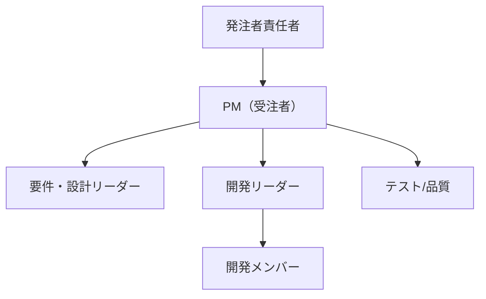

## 1. 本書の目的

本書は、本プロジェクトの目的・体制・スケジュール・管理方法を定義し、関係者間の共通認識を確立することを目的とする。

## 2. プロジェクト概要

| 項目 | 内容 |
|------|------|
| プロジェクト名 | |
| 発注者 | |
| 受注者 | |
| 契約形態 | 請負 / 準委任 |
| 契約期間 | YYYY-MM-DD 〜 YYYY-MM-DD |
| 関連法令・基準 | 例: 政府情報システムの整備及び管理に関する標準ガイドライン |

## 3. 背景・目的・ゴール

- **背景** … 現状の課題、調達に至った経緯
- **目的** … 本プロジェクトで実現すること
- **ゴール（達成基準）** … 定量・定性で測れる完了条件

## 4. スコープ

### 4.1 対象範囲（In Scope）

- 

### 4.2 対象外（Out of Scope）

- 

## 5. 成果物（納品物）

| No | 成果物 | 形式 | 提出時期 | 関連文書ID |
|----|--------|------|----------|-----------|
| 1 | 要件定義書 | PDF/正本MD | 要件定義完了時 | REQ-001 |
| 2 | 基本設計書 | PDF/正本MD | 基本設計完了時 | BD-001 |
| 3 | … | | | |

## 6. 実施体制

| 役割 | 氏名 | 所属 | 責任範囲 |
|------|------|------|----------|
| 発注者責任者 | | | |
| PM | | | |
| 各リーダー | | | |

## 7. スケジュール（マイルストーン）

| フェーズ | 開始 | 終了 | 主要マイルストーン |
|----------|------|------|--------------------|
| 要件定義 | | | 要件定義書承認 |
| 基本設計 | | | 基本設計書承認 |
| 詳細設計・製造 | | | 結合テスト開始 |
| テスト | | | 受入テスト完了 |
| 移行・本番 | | | 本番稼働 |

## 8. 管理方法

| 管理項目 | 方法・ツール | 頻度 |
|----------|--------------|------|
| 進捗管理 | WBS / 定例会 | 週次 |
| 課題管理 | 課題管理表（ISS-001） | 随時 |
| 変更管理 | 変更要求票・影響評価 | 随時 |
| 品質管理 | レビュー・テスト密度/欠陥密度 | フェーズ毎 |
| リスク管理 | リスク管理表（RSK-001） | 隔週 |
| コミュニケーション | 定例会・議事録（MIN-001） | 週次 |

## 9. 前提・制約条件

- 

## 10. リスク（初期）

| No | リスク | 影響 | 対応方針 |
|----|--------|------|----------|
| 1 | | | |

## 11. 用語定義

| 用語 | 定義 |
|------|------|
| | |

---

## 改訂履歴

| 版 | 日付 | 改訂者 | 内容 |
|----|------|--------|------|
| 0.1.0 | 2026-06-29 | <作成者> | 初版作成 |
