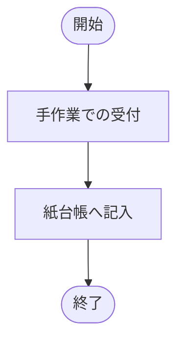
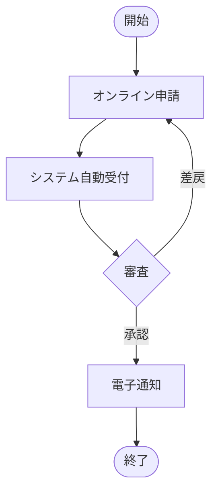

## 1. 本書の目的

業務の視点から、対象業務・業務フロー・業務ルールを整理し、システム化要件の前提を定義する。

## 2. 業務体系

| 業務分類 | 業務名 | 概要 | 担当部署 |
|----------|--------|------|----------|
| | | | |

## 3. 業務フロー（As-Is / To-Be）

### 3.1 As-Is（現行）

### 3.2 To-Be（新業務）

## 4. 業務一覧（業務機能）

| 業務ID | 業務名 | アクター | トリガー | インプット | アウトプット | 頻度・量 |
|--------|--------|----------|----------|-----------|-------------|----------|
| BIZ-001 | | | | | | |

## 5. 業務ルール

| ルールID | ルール内容 | 根拠（規程・法令） |
|----------|-----------|--------------------|
| BR-001 | | |

## 6. 帳票・通知一覧

| No | 帳票/通知名 | 用途 | 出力タイミング | 媒体 |
|----|-------------|------|----------------|------|
| 1 | | | | 画面/PDF/メール |

## 7. 業務量・ピーク

| 業務 | 平常時 | ピーク時 | ピーク時期 |
|------|--------|----------|-----------|
| | | | |

## 8. 関連組織・体制

| 組織 | 役割 | 業務範囲 |
|------|------|----------|
| | | |

---

## 改訂履歴

| 版 | 日付 | 改訂者 | 内容 |
|----|------|--------|------|
| 0.1.0 | 2026-06-29 | <作成者> | 初版作成 |
