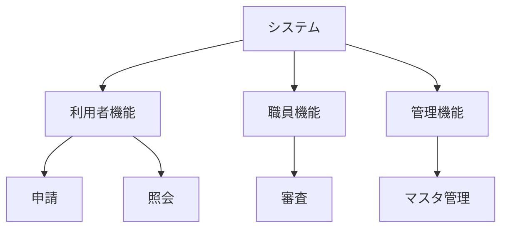

## 1. 本書の目的

本システムの全機能を階層的に一覧化し、要件・画面・APIとのトレーサビリティを確保する。

## 2. 機能階層

## 3. 機能一覧

> 区分: オンライン / バッチ / 外部IF。優先度: 必須 / 推奨 / 任意。

| 機能ID | 大分類 | 中分類 | 機能名 | 概要 | 区分 | 優先度 | 対応画面ID | 対応API-ID | 対応要求ID |
|--------|--------|--------|--------|------|------|--------|-----------|-----------|-----------|
| F-0101 | 利用者機能 | 申請 | 新規申請 | | オンライン | 必須 | SCR-001 | API-001 | FR-001 |
| F-0102 | 利用者機能 | 照会 | 申請状況照会 | | オンライン | 必須 | SCR-010 | API-010 | FR-002 |
| F-0201 | 職員機能 | 審査 | 申請審査 | | オンライン | 必須 | SCR-100 | API-100 | FR-010 |
| F-0301 | 管理機能 | マスタ | 利用者管理 | | オンライン | 推奨 | SCR-900 | API-900 | FR-020 |
| F-9001 | 共通 | バッチ | 夜間集計 | | バッチ | 必須 | — | BATCH-001 | FR-030 |

## 4. 機能数サマリ

| 大分類 | 必須 | 推奨 | 任意 | 計 |
|--------|------|------|------|----|
| 利用者機能 | | | | |
| 職員機能 | | | | |
| 管理機能 | | | | |
| 合計 | | | | |

---

## 改訂履歴

| 版 | 日付 | 改訂者 | 内容 |
|----|------|--------|------|
| 0.1.0 | 2026-06-29 | <作成者> | 初版作成 |
