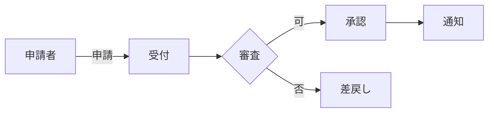

## 1. 本書の目的と範囲

本書は、本システムに求められる業務要件・機能要件・非機能要件を定義し、発注者と受注者の合意の基礎とすることを目的とする。

| 項目 | 内容 |
|------|------|
| 対象システム | |
| 対象業務 | |
| 適用範囲 | |
| 関連文書 | 機能一覧(FNL-001) / 非機能要件(NFR-001) |

## 2. 用語の定義

| 用語 | 定義 |
|------|------|
| | |

## 3. 現行業務と課題（As-Is）

### 3.1 現行業務概要

- 

### 3.2 現状の課題

| No | 課題 | 影響 |
|----|------|------|
| 1 | | |

## 4. 新システムの目的（To-Be）

### 4.1 目的・狙い

- 

### 4.2 業務フロー（To-Be）

### 4.3 期待効果（定量・定性）

| 指標 | 現状 | 目標 |
|------|------|------|
| | | |

## 5. システム化の範囲

### 5.1 システム化対象業務

- 

### 5.2 対象外業務

- 

### 5.3 利用者（アクター）

| アクター | 説明 | 想定人数 |
|----------|------|----------|
| 一般利用者 | | |
| 職員 | | |
| 管理者 | | |

## 6. 機能要件

> 詳細は機能一覧（FNL-001）参照。ここでは要求の概要を記す。

| 要求ID | 機能分類 | 要求内容 | 優先度 |
|--------|----------|----------|--------|
| FR-001 | | | 必須 |
| FR-002 | | | 任意 |

> 優先度: 必須 / 推奨 / 任意（MoSCoW でも可）

## 7. 非機能要件（概要）

> 詳細は非機能要件定義書（NFR-001）参照。

| 分類 | 要求の概要 |
|------|-----------|
| 性能 | |
| 可用性 | |
| セキュリティ | |
| 運用・保守 | |

## 8. 外部インターフェース要件

| No | 連携先システム | 連携内容 | 方式 | 頻度 |
|----|----------------|----------|------|------|
| 1 | | | API/ファイル | |

## 9. データ要件

- 主要なデータ（マスタ・トランザクション）の概要
- 移行対象データの有無

## 10. 制約条件・前提条件

| 区分 | 内容 |
|------|------|
| 技術的制約 | 利用基盤・言語・ブラウザ等 |
| 法令・基準 | 準拠すべき法令・ガイドライン |
| 移行制約 | 稼働時間・移行可能時間帯 |
| 前提条件 | |

## 11. 要件一覧（トレーサビリティ）

| 要求ID | 要求名 | 対応機能ID | 対応テストID | 状態 |
|--------|--------|-----------|-------------|------|
| FR-001 | | | | |

---

## 改訂履歴

| 版 | 日付 | 改訂者 | 内容 |
|----|------|--------|------|
| 0.1.0 | 2026-06-29 | <作成者> | 初版作成 |
