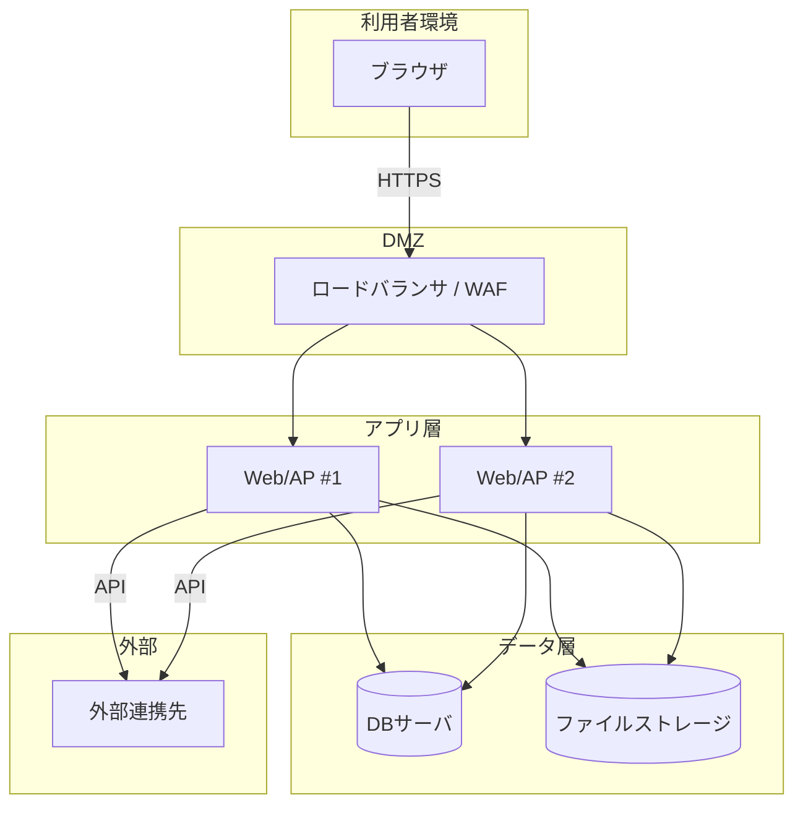

## 1. 本書の目的

システムのハードウェア・ソフトウェア・ネットワーク構成を図示し、構成要素を定義する。

## 2. システム構成図（論理）

## 3. ネットワーク構成

| セグメント | 用途 | 主な機器 | アクセス制御 |
|------------|------|----------|--------------|
| DMZ | 外部公開 | LB/WAF | |
| 内部 | アプリ | Web/AP | |
| DB | データ | DB | DMZ不可 |

## 4. ソフトウェア構成

| 層 | 種別 | 製品・バージョン | 用途 |
|----|------|------------------|------|
| OS | サーバOS | | |
| ミドル | Webサーバ | | |
| ミドル | APサーバ/ランタイム | | |
| ミドル | DBMS | | |
| 言語/FW | | | |

## 5. ハードウェア / インフラ構成

| 機器/インスタンス | 役割 | スペック | 台数 | 冗長化 |
|-------------------|------|----------|------|--------|
| Web/AP | アプリ実行 | | 2 | あり |
| DB | データ保持 | | | |

## 6. 構成管理・命名規則

| 項目 | 規則 |
|------|------|
| ホスト名 | |
| IP体系 | |

---

## 改訂履歴

| 版 | 日付 | 改訂者 | 内容 |
|----|------|--------|------|
| 0.1.0 | 2026-06-29 | <作成者> | 初版作成 |
