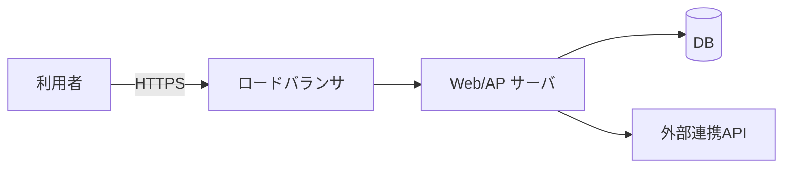

## 1. 本書の目的

要件定義書（REQ-001）に基づき、システムの全体構造・機能・画面・データ・外部連携の設計方針を定義する。

## 2. システム化方針

- アーキテクチャ方針（例: Webアプリ・3層構成・クラウド）
- 採用技術・フレームワーク
- 設計上の重要な決定事項

## 3. システム全体構成

> 詳細はシステム構成図（ARC-001）参照。

## 4. 機能設計

| 機能ID | 機能名 | 処理概要 | 入力 | 出力 | 関連画面/API |
|--------|--------|----------|------|------|--------------|
| F-0101 | 新規申請 | | | | SCR-001 / API-001 |

## 5. 画面設計（概要）

> 詳細は画面設計書（SD-001）・画面遷移図（SCT-001）参照。

| 画面ID | 画面名 | 概要 | 主な機能 |
|--------|--------|------|----------|
| SCR-001 | 申請入力 | | |

## 6. データ設計（概要）

> 詳細はDB設計書（DB-001）参照。

| エンティティ | 概要 | 主なキー |
|--------------|------|----------|
| 申請 | | 申請ID |
| 利用者 | | 利用者ID |

## 7. 外部インターフェース設計

> 詳細はAPI設計書（API-001）参照。

| IF-ID | 連携先 | 方向 | 方式 | 概要 |
|-------|--------|------|------|------|
| EXT-001 | | 送信/受信 | REST/ファイル | |

## 8. バッチ設計（概要）

| バッチID | 名称 | 起動契機 | 概要 |
|----------|------|----------|------|
| BATCH-001 | 夜間集計 | 日次 02:00 | |

## 9. 共通設計方針

| 項目 | 方針 |
|------|------|
| 認証・認可 | |
| エラーハンドリング | |
| ログ出力 | |
| メッセージ管理 | コード体系・多言語 |
| コード設計 | コード値の管理方法 |

## 10. 移行・運用方針（概要）

- 移行: 詳細は移行設計書（MIG-001）
- 運用: 詳細は運用設計書（OPS-001）

---

## 改訂履歴

| 版 | 日付 | 改訂者 | 内容 |
|----|------|--------|------|
| 0.1.0 | 2026-06-29 | <作成者> | 初版作成 |
