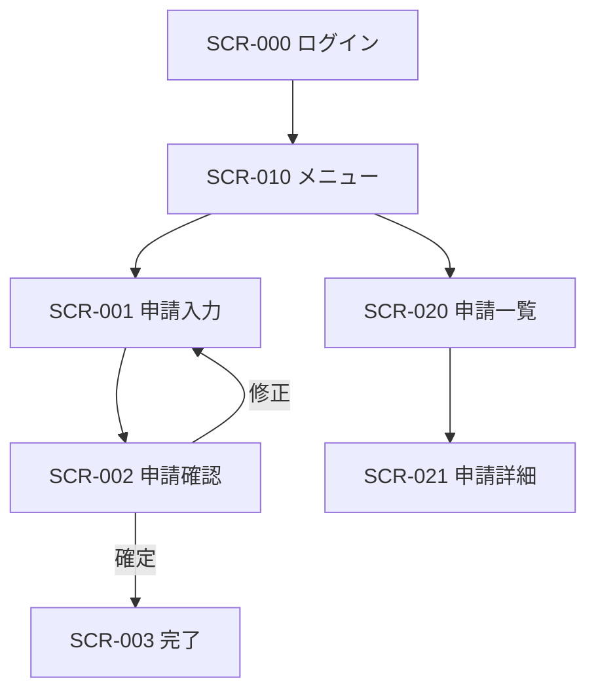

## 1. 本書の目的

画面間の遷移関係を図示し、遷移契機・条件を定義する。

## 2. 画面遷移図（全体）

## 3. 遷移定義

| No | 遷移元 | 操作 | 遷移先 | 遷移条件 | 引継ぎデータ |
|----|--------|------|--------|----------|--------------|
| 1 | SCR-000 | ログイン | SCR-010 | 認証成功 | セッション |
| 2 | SCR-001 | 確認へ進む | SCR-002 | 入力チェックOK | 入力内容 |
| 3 | SCR-002 | 確定 | SCR-003 | 登録成功 | 受付番号 |
| 4 | SCR-002 | 修正 | SCR-001 | — | 入力内容 |

## 4. 共通遷移ルール

- 認証エラー時：ログイン画面へ強制遷移
- セッションタイムアウト：再ログイン要求
- 権限なしアクセス：エラー画面（SCR-999）

---

## 改訂履歴

| 版 | 日付 | 改訂者 | 内容 |
|----|------|--------|------|
| 0.1.0 | 2026-06-29 | <作成者> | 初版作成 |
