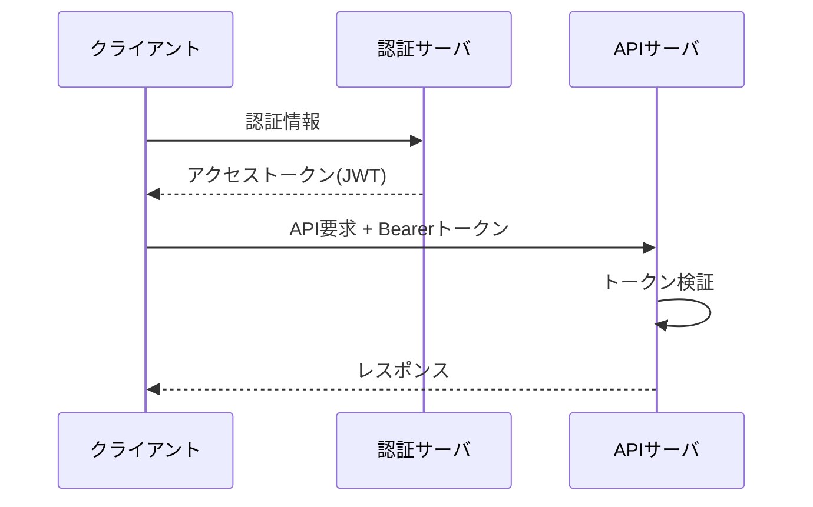

## 1. 本書の目的

REST API のエンドポイント・リクエスト・レスポンス・エラー仕様を定義する。1 API につき第5章を複製して記述する。

## 2. 共通仕様

| 項目 | 内容 |
|------|------|
| プロトコル | HTTPS (TLS1.2+) |
| ベースURL | `https://api.example.go.jp/v1` |
| データ形式 | JSON (UTF-8) |
| 認証方式 | Bearer Token (OAuth2.0 / JWT) |
| 文字コード | UTF-8 |
| 日付形式 | ISO 8601 (`YYYY-MM-DDThh:mm:ss+09:00`) |
| バージョニング | URLパス `/v1` |

### 2.1 共通リクエストヘッダ

| ヘッダ | 必須 | 説明 |
|--------|------|------|
| `Authorization` | ○ | `Bearer <token>` |
| `Content-Type` | ○ | `application/json` |
| `X-Request-Id` | — | リクエスト追跡用 |

### 2.2 共通レスポンス（エラー形式）

```json
{
  "error": {
    "code": "VALIDATION_ERROR",
    "message": "入力値が不正です。",
    "details": [
      { "field": "name", "reason": "required" }
    ]
  }
}
```

### 2.3 HTTPステータスとエラーコード

| HTTP | コード | 意味 |
|------|--------|------|
| 200 | — | 成功 |
| 201 | — | 作成成功 |
| 400 | VALIDATION_ERROR | 入力不正 |
| 401 | UNAUTHORIZED | 未認証 |
| 403 | FORBIDDEN | 権限なし |
| 404 | NOT_FOUND | 対象なし |
| 409 | CONFLICT | 競合 |
| 429 | RATE_LIMITED | 流量制限 |
| 500 | INTERNAL_ERROR | サーバ内部エラー |

## 3. 認証フロー



## 4. API一覧

| API-ID | メソッド | パス | 概要 | 認証 | 対応機能ID |
|--------|----------|------|------|------|-----------|
| API-001 | POST | /applications | 申請登録 | 要 | F-0101 |
| API-010 | GET | /applications/{id} | 申請照会 | 要 | F-0102 |
| API-011 | GET | /applications | 申請一覧 | 要 | F-0102 |
| API-100 | PATCH | /applications/{id}/review | 審査 | 要 | F-0201 |

## 5. API詳細：API-001 申請登録

### 5.1 概要

| 項目 | 内容 |
|------|------|
| API-ID | API-001 |
| メソッド / パス | `POST /applications` |
| 概要 | 新規申請を登録する |
| 認証・認可 | 要・ロール: 利用者 |
| 冪等性 | なし（`X-Idempotency-Key` 任意対応） |

### 5.2 リクエスト

**パスパラメータ**: なし

**リクエストボディ**

| 項目 | 型 | 必須 | 制約 | 説明 |
|------|----|------|------|------|
| `name` | string | ○ | 全角40 | 氏名 |
| `birthDate` | string(date) | ○ | YYYY-MM-DD | 生年月日 |
| `category` | string | ○ | enum[A,B] | 区分 |
| `attachments` | array | — | 最大3 | 添付ファイルID |

```json
{
  "name": "山田 太郎",
  "birthDate": "1990-04-01",
  "category": "A",
  "attachments": ["file_abc123"]
}
```

### 5.3 レスポンス（201 Created）

| 項目 | 型 | 説明 |
|------|----|----|
| `id` | string | 申請ID |
| `receiptNo` | string | 受付番号 |
| `status` | string | 申請状態 |
| `createdAt` | string(datetime) | 受付日時 |

```json
{
  "id": "app_01HXY...",
  "receiptNo": "2026-000123",
  "status": "received",
  "createdAt": "2026-06-29T10:00:00+09:00"
}
```

### 5.4 エラー

| HTTP | code | 発生条件 |
|------|------|----------|
| 400 | VALIDATION_ERROR | 必須未入力・形式不正 |
| 401 | UNAUTHORIZED | トークン無効 |
| 403 | FORBIDDEN | 権限なし |

### 5.5 処理仕様・備考

- トランザクション境界、採番ルール（受付番号）、副作用（通知メール送信）

---

## 改訂履歴

| 版 | 日付 | 改訂者 | 内容 |
|----|------|--------|------|
| 0.1.0 | 2026-06-29 | <作成者> | 初版作成 |
