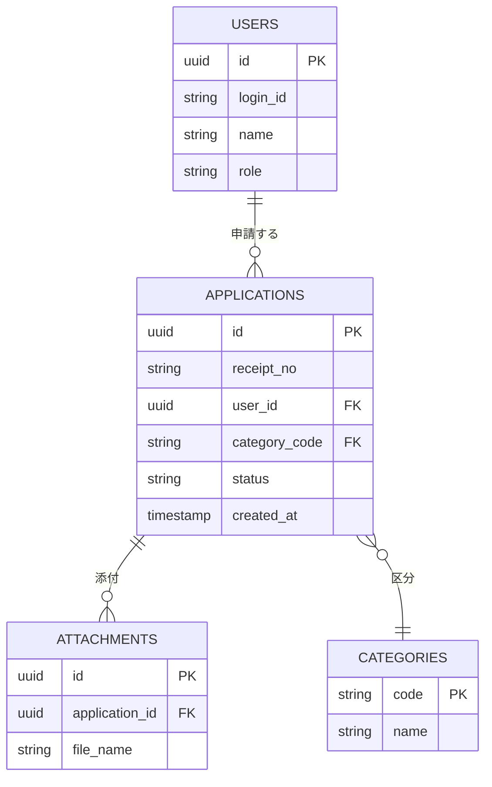

## 1. 本書の目的

データベースの論理・物理設計（ER図・テーブル定義・インデックス）を定義する。

## 2. 設計方針

| 項目 | 内容 |
|------|------|
| DBMS | 例: PostgreSQL 16 |
| 文字コード | UTF-8 |
| 命名規則 | テーブル: スネークケース複数形 / カラム: スネークケース |
| 論理削除 | `deleted_at` による論理削除 / 物理削除 |
| 共通カラム | `created_at` `updated_at` `created_by` `updated_by` |
| 採番 | UUID / シーケンス |

## 3. ER図

## 4. テーブル一覧

| 物理名 | 論理名 | 区分 | 概要 | 想定件数 |
|--------|--------|------|------|----------|
| users | 利用者 | マスタ | 利用者情報 | 1万 |
| applications | 申請 | トランザクション | 申請情報 | 年10万 |
| attachments | 添付ファイル | トランザクション | 添付メタ | |
| categories | 区分 | マスタ | コード値 | 数十 |

## 5. テーブル定義：applications（申請）

| No | 物理名 | 論理名 | 型 | 桁 | NULL | キー | デフォルト | 説明 |
|----|--------|--------|----|----|------|------|-----------|------|
| 1 | id | 申請ID | uuid | — | NO | PK | gen_random_uuid() | |
| 2 | receipt_no | 受付番号 | varchar | 20 | NO | UQ | — | 年-連番 |
| 3 | user_id | 利用者ID | uuid | — | NO | FK | — | users.id |
| 4 | category_code | 区分コード | varchar | 10 | NO | FK | — | categories.code |
| 5 | status | 状態 | varchar | 20 | NO | — | 'received' | received/reviewing/approved/rejected |
| 6 | applied_at | 申請日時 | timestamptz | — | NO | — | now() | |
| 7 | created_at | 作成日時 | timestamptz | — | NO | — | now() | |
| 8 | updated_at | 更新日時 | timestamptz | — | NO | — | now() | |
| 9 | deleted_at | 削除日時 | timestamptz | — | YES | — | NULL | 論理削除 |

### 5.1 インデックス

| 名称 | 種別 | 対象カラム | 用途 |
|------|------|-----------|------|
| pk_applications | PRIMARY | id | |
| uq_applications_receipt | UNIQUE | receipt_no | 受付番号一意 |
| idx_applications_user | INDEX | user_id | 利用者別検索 |
| idx_applications_status | INDEX | status, applied_at | 一覧絞込 |

### 5.2 制約

| 種別 | 内容 |
|------|------|
| FK | user_id → users(id) |
| FK | category_code → categories(code) |
| CHECK | status IN ('received','reviewing','approved','rejected') |

## 6. コード定義（区分マスタ等）

| マスタ | コード | 名称 |
|--------|--------|------|
| categories | A | 区分A |
| categories | B | 区分B |

## 7. データ量・保管・バックアップ

| 項目 | 内容 |
|------|------|
| 年間増加 | |
| 保管期間 | |
| バックアップ | 日次フル + アーカイブログ |

---

## 改訂履歴

| 版 | 日付 | 改訂者 | 内容 |
|----|------|--------|------|
| 0.1.0 | 2026-06-29 | <作成者> | 初版作成 |
