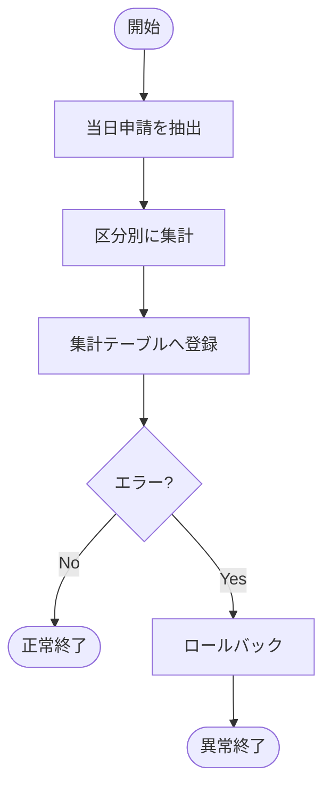

## 1. 本書の目的

バッチ処理の起動契機・処理内容・入出力・エラー時の挙動を定義する。1バッチにつき第3章を複製。

## 2. バッチ一覧

| バッチID | 名称 | 起動契機 | スケジュール | 処理概要 | 多重起動 |
|----------|------|----------|--------------|----------|----------|
| BATCH-001 | 夜間集計 | 時刻 | 日次 02:00 | 当日申請の集計 | 不可 |
| BATCH-002 | データ連携 | 時刻 | 日次 03:00 | 外部システムへ連携 | 不可 |

## 3. バッチ詳細：BATCH-001 夜間集計

### 3.1 概要

| 項目 | 内容 |
|------|------|
| バッチID | BATCH-001 |
| 起動 | ジョブスケジューラ 日次 02:00 |
| 想定処理時間 | 30分以内 |
| 前提ジョブ | なし |
| 後続ジョブ | BATCH-002 |

### 3.2 処理フロー

### 3.3 入出力

| 区分 | 名称 | 形式 | 内容 |
|------|------|------|------|
| 入力 | applications | テーブル | 当日分申請 |
| 出力 | daily_summary | テーブル | 集計結果 |
| 出力 | バッチログ | ログ | 処理件数・結果 |

### 3.4 処理仕様

- 抽出条件 / コミット単位 / 件数ログ出力タイミング

### 3.5 異常時処理・リラン

| 項目 | 内容 |
|------|------|
| エラー時挙動 | ロールバックして異常終了（戻り値≠0） |
| リラン可否 | 可（冪等／中間データクリア後） |
| 通知 | 運用へメール通知 |
| リトライ | 自動リトライなし |

### 3.6 戻り値

| 戻り値 | 意味 |
|--------|------|
| 0 | 正常終了 |
| 1 | 業務エラー |
| 9 | システムエラー |

---

## 改訂履歴

| 版 | 日付 | 改訂者 | 内容 |
|----|------|--------|------|
| 0.1.0 | 2026-06-29 | <作成者> | 初版作成 |
