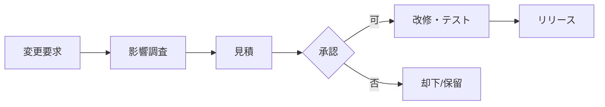

## 1. 本書の目的

本番稼働後の保守業務の範囲・SLA・体制・費用区分を定義する。

## 2. 保守範囲

| 区分 | 内容 | 対象 |
|------|------|------|
| 是正保守 | 不具合の修正 | バグ対応 |
| 予防保守 | 障害予防 | パッチ・点検 |
| 適応保守 | 環境変化対応 | OS/ミドル更新・法改正 |
| 完全化保守 | 改善 | 性能改善・小規模改修 |

## 3. SLA（サービスレベル）

| 項目 | 目標 |
|------|------|
| 受付時間 | 平日 9:00-17:00 |
| 一次回答時間 | 重大: 1時間 / 通常: 翌営業日 |
| 復旧目標(RTO) | 重大: 4時間 |
| 月次報告 | 障害・対応実績の報告 |

## 4. 問い合わせ・受付

| 項目 | 内容 |
|------|------|
| 受付窓口 | メール / 専用ポータル |
| 管理ツール | 課題管理(ISS-001) 等 |
| エスカレーション | 一次→二次→開発 |

## 5. 変更管理

| 項目 | 内容 |
|------|------|
| 変更要求の受付 | 変更要求票 |
| 影響評価 | 影響範囲・工数・リスク |
| 承認 | 発注者承認 |
| リリース | リリース手順・切戻し |

## 6. 保守体制・費用区分

| 役割 | 担当 | 費用区分 |
|------|------|----------|
| 保守責任者 | | 保守契約内 |
| 是正保守 | | 契約内 |
| 改修（適応/完全化） | | 別途見積 |

## 7. 保守対象構成・EOL管理

| 構成要素 | バージョン | サポート期限(EOL) | 更新計画 |
|----------|-----------|-------------------|----------|
| OS | | | |
| ミドルウェア | | | |
| ライブラリ | | | |

---

## 改訂履歴

| 版 | 日付 | 改訂者 | 内容 |
|----|------|--------|------|
| 0.1.0 | 2026-06-29 | <作成者> | 初版作成 |
