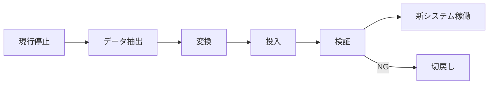

## 1. 本書の目的

現行システムから新システムへのデータ移行・システム切替の方式・手順・体制を定義する。

## 2. 移行方針

| 項目 | 内容 |
|------|------|
| 移行方式 | 一括移行 / 段階移行 |
| 切替方式 | ビッグバン / 並行稼働 |
| 移行可能時間帯 | 例: 土曜21:00〜日曜6:00 |
| リハーサル回数 | 例: 2回 |

## 3. 移行対象データ

| No | データ名 | 現行ソース | 件数 | 移行要否 | 変換要否 | 備考 |
|----|----------|-----------|------|----------|----------|------|
| 1 | 利用者 | 旧DB users | 1万 | 要 | 要 | コード変換 |
| 2 | 申請履歴 | 旧DB apps | 50万 | 要 | 要 | 直近3年分 |
| 3 | 添付ファイル | ファイルサーバ | | 要 | 否 | |

## 4. データ変換ルール

| 項目 | 変換元 | 変換先 | ルール |
|------|--------|--------|--------|
| 区分コード | 旧:1,2 | 新:A,B | 1→A, 2→B |
| 日付 | YYYYMMDD | DATE | 形式変換 |

## 5. 移行手順（タイムライン）

| No | 作業 | 開始 | 所要 | 担当 | 確認方法 |
|----|------|------|------|------|----------|
| 1 | 現行システム停止 | T+0:00 | 0:15 | | |
| 2 | データ抽出 | | 1:00 | | 件数確認 |
| 3 | 変換・投入 | | 2:00 | | ログ確認 |
| 4 | 移行検証 | | 1:00 | | 件数/サンプル照合 |
| 5 | 新システム稼働確認 | | 0:30 | | 疎通確認 |

## 6. 移行検証（突合）

| 検証項目 | 方法 | 合格基準 |
|----------|------|----------|
| 件数一致 | 移行前後の件数比較 | 完全一致 |
| サンプル突合 | 抽出サンプル目視 | 差異0 |
| ハッシュ照合 | ファイルチェックサム | 一致 |

## 7. 切戻し（コンティンジェンシー）

| 項目 | 内容 |
|------|------|
| 切戻し判断基準 | 移行検証NG・重大障害 |
| 判断者 | PM・発注者責任者 |
| 切戻し期限 | 稼働判定時刻まで |
| 切戻し手順 | 現行データ復元・現行再開 |

## 8. 移行体制

| 役割 | 担当 | 連絡先 |
|------|------|--------|
| 移行責任者 | | |
| 作業担当 | | |
| 検証担当 | | |

---

## 改訂履歴

| 版 | 日付 | 改訂者 | 内容 |
|----|------|--------|------|
| 0.1.0 | 2026-06-29 | <作成者> | 初版作成 |
