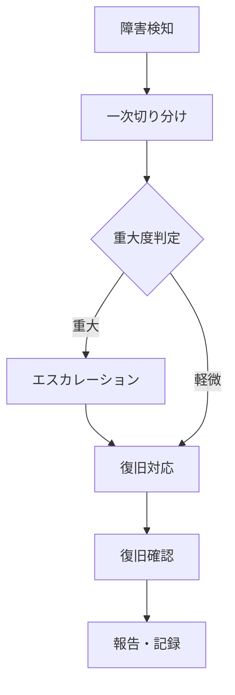

## 1. 本書の目的

本番稼働後の運用業務（監視・バックアップ・ジョブ・障害対応）を定義する。

## 2. 運用時間・体制

| 項目 | 内容 |
|------|------|
| サービス提供時間 | 例: 平日 8:00-20:00 |
| 運用監視時間 | 例: 24/365 または営業時間 |
| 運用体制 | 一次/二次/開発エスカレーション |

| 役割 | 担当 | 連絡先 | 対応範囲 |
|------|------|--------|----------|
| 一次運用 | | | 監視・定型対応 |
| 二次運用 | | | 障害切り分け |
| 保守(開発) | | | 不具合修正 |

## 3. 監視設計

| 監視対象 | 監視項目 | しきい値 | 通知先 | 対応 |
|----------|----------|----------|--------|------|
| サーバ | CPU/メモリ | 80%超 | 運用 | 調査 |
| サーバ | ディスク | 85%超 | 運用 | 拡張/削除 |
| プロセス | 死活 | 停止 | 運用 | 再起動手順 |
| ログ | エラーログ | ERROR検知 | 運用 | 内容確認 |
| 外部連携 | 疎通 | 失敗 | 運用 | 連携先確認 |

## 4. ジョブ運用

| ジョブID | 名称 | スケジュール | 監視 | 異常時対応 |
|----------|------|--------------|------|-----------|
| BATCH-001 | 夜間集計 | 日次02:00 | 戻り値監視 | リラン手順 |

## 5. バックアップ / リストア

| 対象 | 種別 | 取得時刻 | 世代 | 保管先 | リストア手順 |
|------|------|----------|------|--------|--------------|
| DB | フル | 日次01:00 | 7世代 | | 手順書参照 |
| DB | アーカイブログ | 継続 | | | |
| ファイル | 増分 | 日次 | 7世代 | | |

## 6. 障害対応フロー

| 重大度 | 定義 | 初動目標 | 報告先 |
|--------|------|----------|--------|
| Lv1 | 全面停止 | 即時 | 発注者責任者 |
| Lv2 | 一部機能停止 | 1時間以内 | 運用責任者 |
| Lv3 | 軽微 | 翌営業日 | — |

## 7. 定期作業

| 作業 | 周期 | 内容 |
|------|------|------|
| ログ点検 | 日次 | エラーログ確認 |
| 領域監視 | 週次 | ディスク使用量 |
| パッチ適用 | 月次 | セキュリティパッチ |
| 訓練 | 年次 | 障害/復旧訓練 |

## 8. 運用引継ぎ・手順書

- 運用手順書・連絡網・問い合わせ窓口（ヘルプデスク）の整備状況

---

## 改訂履歴

| 版 | 日付 | 改訂者 | 内容 |
|----|------|--------|------|
| 0.1.0 | 2026-06-29 | <作成者> | 初版作成 |
